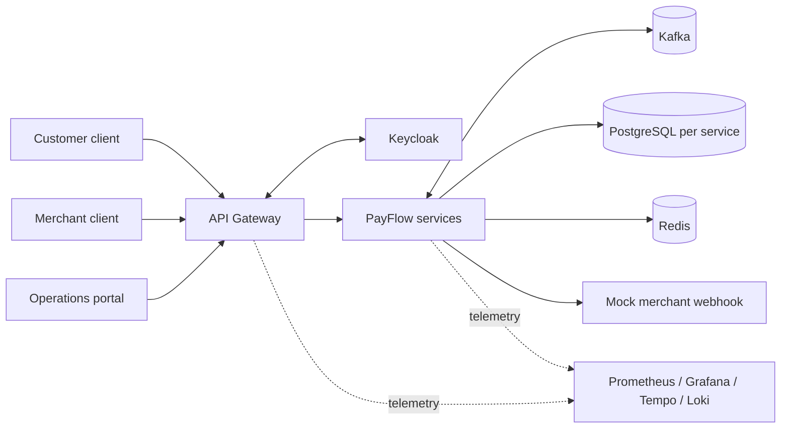
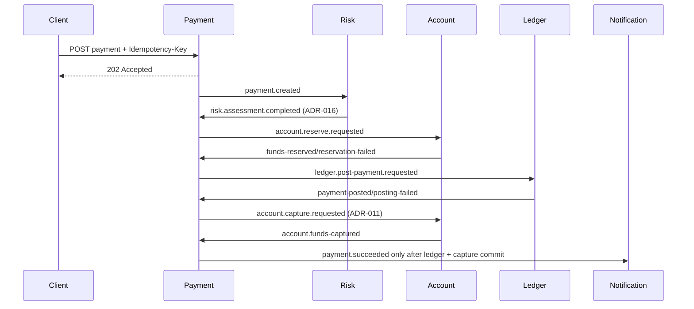

# Kiến trúc PayFlow

## 1. Driver kiến trúc

Thiết kế ưu tiên theo thứ tự:

1. Tính đúng đắn của tiền và state transition.
2. Không mất event và không tạo side effect trùng.
3. Khả năng recovery/audit khi một bước thất bại.
4. Tenant isolation và least privilege.
5. Quan sát và kiểm chứng được.
6. Khả năng mở rộng độc lập khi có bằng chứng cần thiết.

Microservice là phương tiện để thể hiện ownership và failure isolation, không phải mục tiêu số lượng.

## 2. System context



Keycloak xác thực danh tính. Gateway xử lý edge concern; business authorization và ownership vẫn được kiểm tra tại service sở hữu use case.

## 3. Topology theo phase

### Phase 1 — vertical slice MVP

```text
api-gateway
payment-service             # payment state + Saga orchestration + merchant MVP module
account-ledger-service      # account/reservation và ledger là hai domain boundary trong một deployable
risk-service
notification-service
```

Mục đích của việc gộp Account/Ledger là giảm chi phí vận hành ban đầu. Code, schema namespace, contract và transaction boundary phải được tổ chức để không biến thành một domain trộn lẫn.

### Phase 2 — split topology

```text
api-gateway
merchant-service
payment-service
account-service
ledger-service
risk-service
notification-service
reporting-service
```

Chỉ tách `account-ledger-service` sau khi happy path, compensation và idempotency suite đạt gate. Việc tách thêm network hop nhưng không chứng minh reliability không được xem là tiến bộ.

### Phase 3 — production-like additions

```text
settlement-service
```

Settlement chỉ được thêm ở Phase 3 sau khi refund/reporting contract và reliability gate đã đạt.

## 4. Cấu trúc monorepo mục tiêu

```text
payflow/
├── AGENTS.md
├── PAYFLOW_MICROSERVICE_PROJECT_SPEC.md
├── pom.xml
├── docker-compose.yml
├── .env.example
├── .agent/
├── .agents/skills/
├── .docs/
├── docs/
│   ├── api/
│   ├── architecture/
│   ├── adr/
│   ├── diagrams/
│   ├── postman/
│   └── runbooks/
├── libs/
│   ├── event-contracts/
│   ├── observability-support/
│   └── test-support/
├── services/
│   ├── api-gateway/
│   ├── payment-service/
│   ├── account-ledger-service/
│   ├── risk-service/
│   └── notification-service/
└── infrastructure/
    ├── docker/
    ├── kafka/
    ├── keycloak/
    ├── monitoring/
    ├── k8s/
    └── scripts/
```

`.docs/` là hướng dẫn cho agent trong giai đoạn xây dựng. `docs/` là tài liệu sản phẩm/portfolio được bàn giao cho người đọc repository. Khi implementation bắt đầu, không dùng `.docs/` thay cho OpenAPI, AsyncAPI/event schema, runbook hoặc ADR chính thức trong `docs/`.

## 5. Kiến trúc bên trong service

Một service lớn tổ chức package theo feature/domain trước, layer sau:

```text
com.payflow.payment/
├── api/
│   ├── PaymentController.java
│   ├── request/
│   └── response/
├── application/
│   ├── command/
│   ├── query/
│   ├── handler/
│   └── port/
├── domain/
│   ├── model/
│   ├── policy/
│   ├── event/
│   └── exception/
└── infrastructure/
    ├── persistence/
    ├── messaging/
    ├── security/
    └── config/
```

Hướng phụ thuộc:

```text
api/consumer -> application -> domain
infrastructure -> application ports/domain
domain -> Java standard library only
```

- API/consumer chuyển input thành command/query và không truy cập database trực tiếp.
- Application điều phối use case, authorization và local transaction.
- Domain bảo vệ invariant/state transition mà không cần Spring.
- Infrastructure triển khai JPA, Kafka, Redis, HTTP, security và configuration.
- Không tạo đủ layer máy móc cho feature nhỏ; vẫn giữ đúng hướng phụ thuộc và DTO boundary.

## 6. Data ownership

| Owner | Dữ liệu độc quyền | Service khác nhận dữ liệu bằng |
| --- | --- | --- |
| Payment | payment, refund, idempotency, status history, Saga, outbox/inbox | REST query hoặc payment/refund event |
| Account | account, balance reservation, balance audit, outbox/inbox | account command/event |
| Ledger | ledger account, journal, entry, outbox/inbox | ledger command/event, read-only query có kiểm soát |
| Risk | assessment, risk case, rule result, outbox/inbox | risk event/query |
| Merchant | merchant, member, API key, webhook config, fee policy | merchant event/query hoặc immutable snapshot trong command |
| Notification | notification, webhook delivery, retry state, inbox | notification command/event |
| Settlement | settlement batch/item, reconciliation result, inbox/outbox | payment/refund/ledger event |
| Reporting | denormalized read model/checkpoint | event projection |

Không dùng foreign key xuyên database. ID từ bounded context khác được lưu như reference và xác thực thông qua contract/workflow, không qua cross-service join.

## 7. Giao tiếp đồng bộ và bất đồng bộ

### Dùng REST khi

- client tạo/query resource và cần phản hồi HTTP;
- operations cần query chi tiết hiện tại;
- một internal lookup thực sự cần kết quả ngay và có timeout/fallback rõ ràng.

### Dùng Kafka khi

- điều phối payment/refund Saga;
- phát domain fact cho nhiều consumer;
- cập nhật reporting/settlement/notification;
- caller không cần giữ request thread trong toàn workflow.

Mọi REST nội bộ có connect/read timeout. Mọi Kafka command/event có owner, schema/version, key, producer, consumer và failure policy.

## 8. Payment Saga

Payment Service là orchestrator và sở hữu state của workflow.



Mỗi mũi tên bất đồng bộ được tạo qua outbox; mỗi receiver xử lý idempotent.

### Failure matrix

| Điểm lỗi | Kết quả bắt buộc |
| --- | --- |
| Risk reject | Không reserve; payment `RISK_REJECTED`/failed fact |
| Reserve thiếu tiền | Không tạo journal; payment `FAILED` |
| Ledger lỗi sau reserve | Bounded retry, sau đó release; payment `FAILED` hoặc manual review |
| Duplicate command/event | Trả/no-op theo kết quả cũ, không side effect mới |
| Orchestrator restart | Tiếp tục từ persisted Saga state/deadline |
| Compensation timeout | `MANUAL_REVIEW_REQUIRED`, alert và runbook; không giả vờ thành công |
| Capture/finalization confirmation chậm | Giữ `PROCESSING`; bounded retry rồi manual review/reconciliation theo ADR-011; không release sau journal POSTED và không công bố outcome sai |

Trạng thái cuối chỉ được phát khi tất cả precondition tài chính tương ứng đã commit. ADR-011 đã chốt
thứ tự `ledger.payment-posted` → `account.capture.requested` → `account.funds-captured` →
`payment.succeeded`. ADR-012/018 đã khóa recovery và manual-review semantics; ADR-017 đã khóa inbox
insert-if-new. Core policy, Saga JPA persistence, optimistic scheduler, Kafka listener/router và
transactional consumer use case đã có. Listener manual-ack sau local commit; failure được retry hữu
hạn rồi chuyển DLT. PostgreSQL/Kafka integration gate vẫn chưa được chạy.

## 9. Atomicity pattern

### Producer transaction

```text
BEGIN
  mutate aggregate/business tables
  append outbox event with complete envelope
COMMIT
```

Publisher không được giữ database transaction mở trong lúc gọi Kafka. Claim/reclaim protocol phải được giải quyết theo OD-008: transaction ngắn nhận lease bền vững, publish ngoài transaction, conditional mark theo owner và reclaim lease hết hạn. Crash giữa publish và mark vẫn có thể tạo duplicate, vì vậy consumer bắt buộc idempotent.

### Consumer transaction

```text
receive event
BEGIN
  insert-if-new processed_events(event_id, consumer_name)
  if affected rows = 0: COMMIT and acknowledge
  apply business invariant/state transition
  append outgoing outbox event when needed
COMMIT
acknowledge Kafka
```

Không tách inbox insert khỏi business mutation. Trên PostgreSQL, dùng `INSERT ... ON CONFLICT DO NOTHING`/affected-row gate hoặc cơ chế savepoint tương đương đã test; không catch unique violation rồi tiếp tục trong transaction đã aborted. Unique constraint là hàng rào cuối, không chỉ dùng `exists()` check.

## 10. Consistency và concurrency

- Payment, refund và Saga dùng optimistic locking cùng state-transition condition.
- Account reserve dùng conditional atomic update hoặc pessimistic row lock trong transaction ngắn.
- Refund concurrent dùng row lock/atomic aggregate constraint để tổng amount không vượt payment.
- Ledger cân bằng được validate trên toàn journal trước post và được bảo vệ bằng transaction/constraint phù hợp.
- Reporting và settlement projection chấp nhận eventual consistency; phải hiển thị data freshness/checkpoint khi cần.
- Scheduled recovery job phải có lease/locking để nhiều instance không xử lý cùng work item như hai owner độc lập.

## 11. Security architecture

- Authorization Code + PKCE cho browser client; client credentials cho service account.
- Gateway validate token, rate limit, correlation ID, CORS và request size.
- Service validate issuer/audience/signature và method/ownership authorization.
- Database/Kafka/Redis không public; credential và network policy tách theo service ở production-like phase.
- Webhook outbound ký HMAC, timeout ngắn, bulkhead, retry có lịch và DLT/manual retry.
- Audit log là append-oriented record cho privileged action; không chứa secret.

## 12. Observability architecture

- W3C trace context qua HTTP; trace/correlation/causation metadata qua Kafka headers/envelope.
- Structured log dùng stable event/error code và business ID, tránh raw payload nhạy cảm.
- Metrics gồm RED metrics cho API, JVM/resource metrics và domain/reliability metrics.
- Dashboard phải nối được symptom tới cause: failure rate -> Saga step -> outbox/consumer lag -> service/database health.
- Alert chỉ có giá trị khi kèm owner và runbook.

## 13. Những pattern bị cấm

- Shared database access hoặc shared JPA entity giữa service.
- Kafka publish không có outbox.
- Consumer không có deduplication bền vững.
- REST chain kéo dài toàn payment workflow.
- Redis làm số dư hoặc ledger source of truth.
- Retry vô hạn, retry validation/business rejection hoặc commit offset sau lỗi bị nuốt.
- Update/delete journal đã posted.
- `double`/`float` cho tiền.
- Đặt transaction xuyên network call dài.
- Dựng Kubernetes/10 service trước khi E2E và compensation chạy ổn định.
