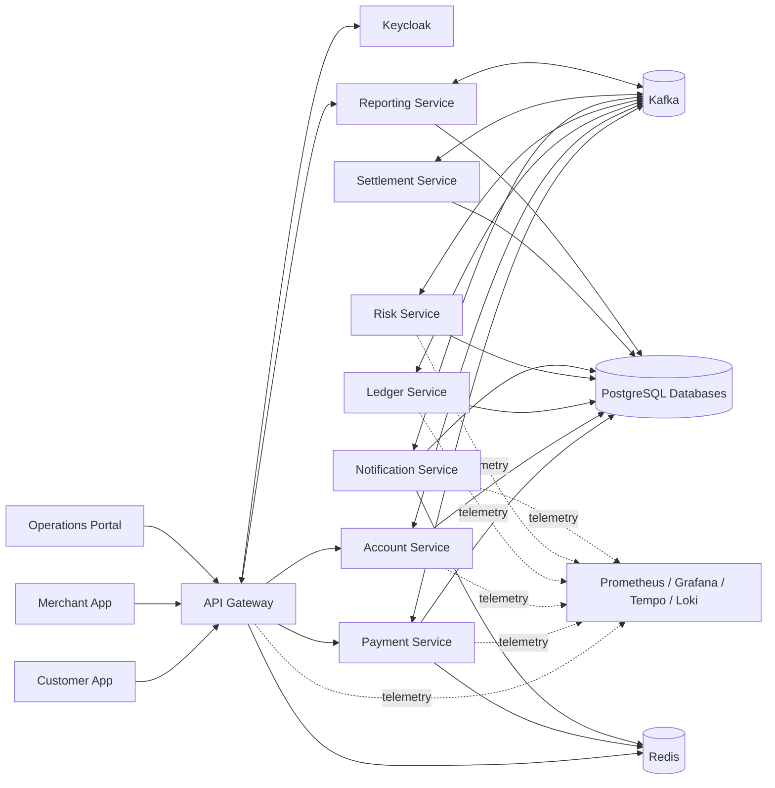
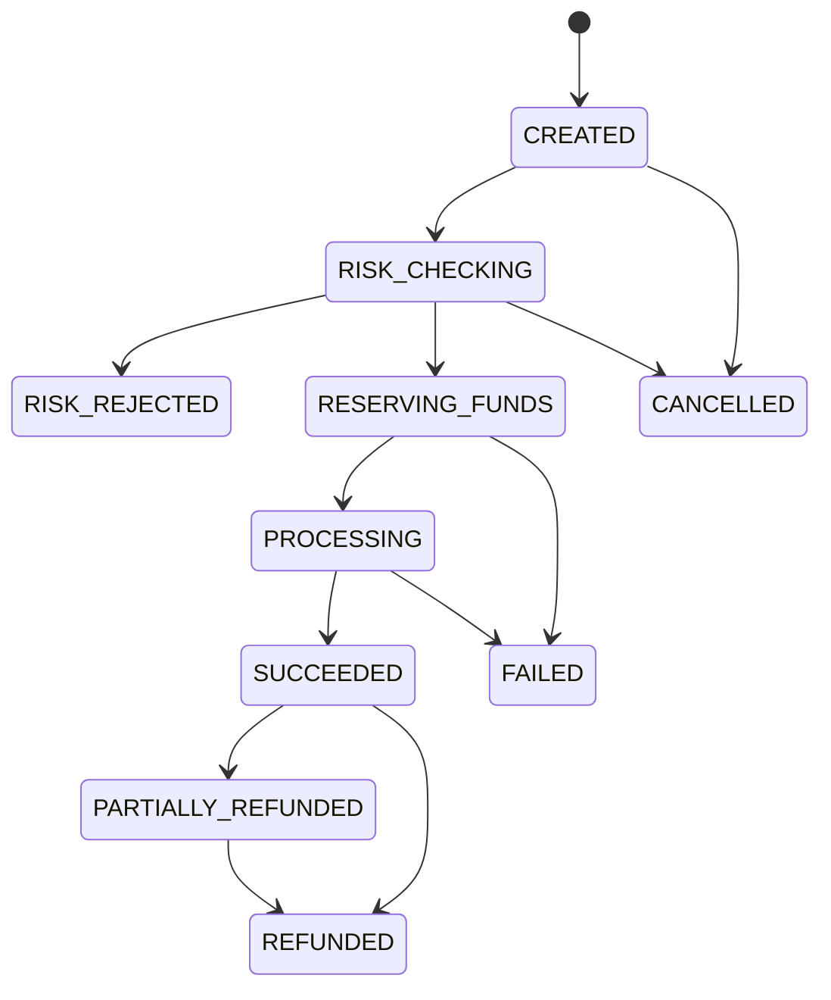
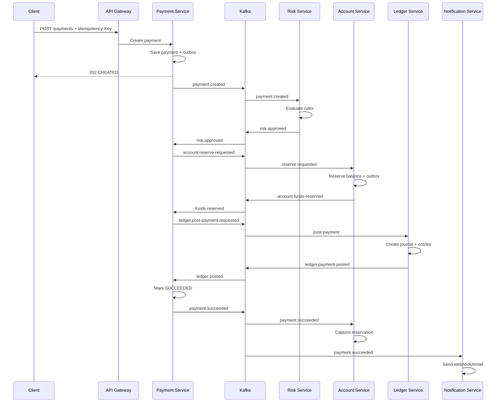

# PAYFLOW — PAYMENT, LEDGER & FRAUD DETECTION PLATFORM

> **Loại dự án:** Java Spring Boot Microservices  
> **Mục tiêu:** Luyện tập Java Backend, Microservices, Event-driven Architecture, Distributed Transactions, DevOps và domain Fintech/Payment.  
> **Phạm vi:** Hệ thống sandbox sử dụng tiền và dữ liệu giả lập; không xử lý tiền thật, không kết nối ngân hàng thật.  
> **Đối tượng sử dụng tài liệu:** Developer và AI Coding Agent dùng để phân tích, thiết kế và triển khai dự án theo từng giai đoạn.

---

## 1. Tổng quan dự án

### 1.1. Tên dự án

**PayFlow — Payment, Ledger & Fraud Detection Platform**

PayFlow là nền tảng thanh toán giả lập dành cho merchant, cho phép:

- Tạo và theo dõi giao dịch thanh toán.
- Quản lý tài khoản và số dư.
- Giữ tiền trước khi hoàn tất thanh toán.
- Hoàn tiền toàn phần hoặc một phần.
- Ghi nhận bút toán kép trong ledger.
- Kiểm tra giao dịch đáng ngờ bằng rule engine.
- Gửi webhook và thông báo.
- Đối soát giao dịch theo ngày.
- Theo dõi dashboard vận hành.
- Quan sát toàn bộ hệ thống bằng metrics, logs và distributed tracing.

### 1.2. Vấn đề dự án giải quyết

Trong hệ thống phân tán, một giao dịch thanh toán không chỉ là thao tác trừ tiền. Nó cần giải quyết:

- Request được gửi lại nhiều lần do mạng chậm.
- Một event có thể được Kafka giao lại.
- Service có thể chết giữa quá trình xử lý.
- Database đã commit nhưng event chưa được publish.
- Một bước thất bại sau khi các bước trước đã thành công.
- Số dư không được âm.
- Tổng debit phải bằng tổng credit.
- Giao dịch hoàn tiền không được vượt quá số tiền đã thanh toán.
- Merchant cần nhận webhook đáng tin cậy.
- Hệ thống cần truy vết một giao dịch qua nhiều service.

PayFlow được thiết kế để luyện các vấn đề trên thay vì chỉ xây CRUD.

### 1.3. Mục tiêu kỹ thuật

Sau khi hoàn thành, dự án cần chứng minh được các kỹ năng:

- Java 21.
- Spring Boot.
- Spring Security và OAuth2/OIDC.
- Spring Cloud Gateway.
- PostgreSQL và database-per-service.
- Redis.
- Apache Kafka.
- Saga orchestration hoặc choreography.
- Transactional Outbox.
- Idempotency.
- Optimistic/Pessimistic Locking.
- Retry, timeout, circuit breaker.
- Dead Letter Topic.
- REST API design.
- Docker và Docker Compose.
- Kubernetes.
- CI/CD.
- Unit, integration, contract và end-to-end testing.
- Metrics, logs và distributed tracing.
- Fintech concepts: account, balance reservation, ledger, refund, settlement, reconciliation.

---

## 2. Phạm vi và nguyên tắc triển khai

### 2.1. Trong phạm vi

- Người dùng đăng nhập qua OIDC.
- Merchant tạo API key hoặc sử dụng access token.
- Tạo payment.
- Xác minh request bằng idempotency key.
- Risk service đánh giá giao dịch.
- Account service giữ hoặc giải phóng tiền.
- Ledger service tạo double-entry journal.
- Payment service cập nhật trạng thái.
- Notification service gửi email giả lập và webhook.
- Settlement service tổng hợp giao dịch merchant.
- Reporting service tạo dashboard.
- Hệ thống có audit log và tracing.

### 2.2. Ngoài phạm vi phiên bản đầu

- Kết nối Visa, Mastercard hoặc ngân hàng thật.
- KYC thật.
- Chuyển tiền thật.
- Lưu thông tin thẻ thật.
- PCI DSS production compliance.
- Machine Learning phức tạp.
- Multi-region active-active.
- Blockchain hoặc cryptocurrency.
- Mobile application.

### 2.3. Quy tắc an toàn domain

- Chỉ sử dụng số dư giả lập.
- Không lưu số thẻ ngân hàng thật.
- Không yêu cầu CCCD, hộ chiếu hoặc dữ liệu nhạy cảm thật.
- Dữ liệu seed phải là dữ liệu giả.
- Không triển khai endpoint chuyển tiền ra hệ thống bên ngoài.
- Mọi webhook trong môi trường local phải gọi tới mock server.

---

## 3. Stack công nghệ đề xuất

## 3.1. Baseline chính

| Thành phần | Công nghệ |
|---|---|
| JDK | Java 21 LTS |
| Framework | Spring Boot 4.1.x |
| Cloud stack | Spring Cloud 2025.1.x |
| Build tool | Maven |
| API Gateway | Spring Cloud Gateway Server WebFlux |
| Security | Spring Security OAuth2 Resource Server |
| Identity Provider | Keycloak |
| Database | PostgreSQL |
| ORM | Spring Data JPA + Hibernate |
| Migration | Flyway |
| Messaging | Apache Kafka |
| Cache/Lock/Rate limit | Redis |
| Resilience | Resilience4j |
| API docs | springdoc-openapi |
| Mapping | MapStruct |
| Boilerplate | Lombok, sử dụng có kiểm soát |
| Testing | JUnit 5, Mockito, AssertJ, Testcontainers, WireMock |
| Container | Docker, Docker Compose |
| Orchestration | Kubernetes |
| Metrics | Micrometer + Prometheus |
| Tracing | OpenTelemetry + Tempo hoặc Jaeger |
| Logs | Logback JSON + Loki |
| Dashboard | Grafana |
| CI/CD | GitHub Actions |
| Load testing | k6 |
| Static analysis | SonarQube, SpotBugs hoặc Checkstyle |

### 3.2. Phương án tương thích

Khi thư viện chưa tương thích với Spring Boot 4:

- Java 21.
- Spring Boot 3.5.16.
- Spring Cloud 2025.0.3.

Không trộn Spring Boot và Spring Cloud sai release train.

### 3.3. Nguyên tắc chọn dependency

AI Coding Agent phải:

1. Sử dụng Spring Initializr hoặc Maven Central để kiểm tra dependency tồn tại.
2. Dùng Spring Boot BOM và Spring Cloud BOM.
3. Không hard-code version cho dependency đã được BOM quản lý.
4. Không dùng dependency snapshot hoặc milestone.
5. Chạy `mvn dependency:tree` khi có xung đột.
6. Ưu tiên thư viện chính chủ hoặc phổ biến.
7. Không tự phát minh artifact name hoặc version.

---

## 4. Kiến trúc tổng thể

### 4.1. Sơ đồ context



### 4.2. Các nguyên tắc kiến trúc

- Mỗi service sở hữu database/schema riêng.
- Service khác không truy cập trực tiếp database của nhau.
- REST dùng cho truy vấn đồng bộ cần phản hồi ngay.
- Kafka dùng cho workflow và cập nhật bất đồng bộ.
- Không dùng distributed ACID transaction giữa nhiều database.
- Dùng Saga và compensating action.
- Event phải có version.
- Consumer phải idempotent.
- Không phụ thuộc vào thứ tự toàn cục; chỉ đảm bảo thứ tự theo aggregate key.
- Dữ liệu báo cáo là read model, có thể eventual consistency.
- Mọi request phải có `correlationId`.
- Mọi event phải có `eventId`, `aggregateId`, `eventType`, `version` và `occurredAt`.

---

## 5. Kiến trúc repository

### 5.1. Khuyến nghị: Monorepo

```text
payflow/
├─ README.md
├─ pom.xml
├─ docker-compose.yml
├─ .env.example
├─ docs/
│  ├─ architecture/
│  ├─ adr/
│  ├─ api/
│  ├─ diagrams/
│  ├─ runbooks/
│  └─ postman/
├─ infrastructure/
│  ├─ docker/
│  ├─ kafka/
│  ├─ keycloak/
│  ├─ monitoring/
│  ├─ k8s/
│  │  ├─ base/
│  │  └─ overlays/
│  │     ├─ local/
│  │     ├─ staging/
│  │     └─ production/
│  └─ scripts/
├─ libs/
│  ├─ event-contracts/
│  ├─ test-support/
│  └─ observability-support/
├─ services/
│  ├─ api-gateway/
│  ├─ payment-service/
│  ├─ account-service/
│  ├─ ledger-service/
│  ├─ risk-service/
│  ├─ notification-service/
│  ├─ settlement-service/
│  └─ reporting-service/
└─ frontend/
   ├─ merchant-portal/
   └─ operations-portal/
```

### 5.2. Shared library được phép chứa

- Event envelope.
- Enum hoặc schema dùng chung thật sự ổn định.
- Test fixtures.
- Observability helpers.
- Error-code conventions.

### 5.3. Shared library không được chứa

- JPA Entity.
- Repository.
- Domain service.
- Business logic.
- DTO nội bộ của từng service.
- Database migration.

Nếu chia sẻ quá nhiều code, các service sẽ bị coupling như modular monolith nhưng khó vận hành hơn.

---

## 6. Các actor và quyền

| Actor | Mô tả | Quyền chính |
|---|---|---|
| CUSTOMER | Người dùng thanh toán giả lập | Xem tài khoản, tạo payment, xem lịch sử |
| MERCHANT_USER | Nhân viên merchant | Tạo payment, xem giao dịch merchant |
| MERCHANT_ADMIN | Quản trị merchant | Quản lý API key, webhook, nhân viên |
| RISK_ANALYST | Nhân viên kiểm soát rủi ro | Xem và review giao dịch rủi ro |
| OPERATIONS | Nhân viên vận hành | Xem giao dịch, retry webhook, đối soát |
| SYSTEM_ADMIN | Quản trị hệ thống | Quản lý cấu hình, role, audit |
| SERVICE_ACCOUNT | Giao tiếp service-to-service | Chỉ scope cần thiết |

### 6.1. Role mapping mẫu

```text
CUSTOMER:
- account:read:self
- payment:create:self
- payment:read:self

MERCHANT_USER:
- payment:create:merchant
- payment:read:merchant
- refund:create:merchant

MERCHANT_ADMIN:
- inherits MERCHANT_USER
- merchant:update
- api-key:manage
- webhook:manage
- member:manage

RISK_ANALYST:
- risk:read
- risk:review

OPERATIONS:
- payment:read:any
- webhook:retry
- settlement:run
- reconciliation:run

SYSTEM_ADMIN:
- system:admin
```

---

## 7. Danh sách microservice

## 7.1. API Gateway

### Trách nhiệm

- Xác thực JWT.
- Route request.
- Rate limiting.
- CORS.
- Request size limit.
- Correlation ID.
- Chuẩn hóa error response ở edge.
- Forward user/merchant context an toàn.
- Metrics cho request.
- Không chứa business logic.

### Route mẫu

```yaml
/api/v1/payments/**        -> payment-service
/api/v1/accounts/**        -> account-service
/api/v1/merchants/**       -> merchant module/service
/api/v1/reports/**         -> reporting-service
/api/v1/risk-cases/**      -> risk-service
/api/v1/settlements/**     -> settlement-service
```

### Filter bắt buộc

- Authentication filter.
- Correlation ID filter.
- Rate limit filter.
- Request logging filter, không log token hoặc dữ liệu nhạy cảm.
- Response time metric.
- Optional idempotency header validation cho POST payment/refund.

---

## 7.2. Identity và Access Management

### Lựa chọn

Sử dụng Keycloak thay vì tự xây password login.

### Realm

```text
payflow
```

### Clients

| Client | Type | Mục đích |
|---|---|---|
| merchant-portal | Public + PKCE | Web merchant |
| operations-portal | Public + PKCE | Web admin |
| api-gateway | Confidential | Gateway |
| service-clients | Confidential | Client credentials |

### Token claims cần dùng

- `sub`
- `preferred_username`
- `email`
- `realm_access.roles`
- `merchant_id`
- `scope`
- `azp`

### Quy tắc

- Frontend dùng Authorization Code Flow + PKCE.
- Backend là OAuth2 Resource Server.
- Service-to-service dùng client credentials hoặc token exchange khi cần.
- Không truyền password giữa các service.
- Không lưu access token vào database.
- Không log JWT.

---

## 7.3. Merchant Service

Có thể là service riêng ở giai đoạn 2 hoặc module trong payment-service ở MVP.

### Chức năng

- Tạo merchant.
- Cập nhật hồ sơ.
- Quản lý trạng thái merchant.
- Quản lý webhook endpoint.
- Quản lý API key.
- Quản lý thành viên.
- Quản lý phí giao dịch.
- Quản lý hạn mức.

### Trạng thái merchant

```text
PENDING
ACTIVE
SUSPENDED
CLOSED
```

### Bảng dữ liệu

#### merchants

| Cột | Kiểu | Ghi chú |
|---|---|---|
| id | UUID | PK |
| code | VARCHAR(50) | unique |
| name | VARCHAR(200) | |
| status | VARCHAR(30) | |
| default_currency | CHAR(3) | VND |
| fee_rate | NUMERIC(8,6) | ví dụ 0.020000 |
| max_transaction_amount | NUMERIC(19,4) | |
| created_at | TIMESTAMPTZ | |
| updated_at | TIMESTAMPTZ | |
| version | BIGINT | optimistic lock |

#### merchant_members

| Cột | Kiểu |
|---|---|
| id | UUID |
| merchant_id | UUID |
| user_id | UUID/string Keycloak subject |
| role | VARCHAR(50) |
| status | VARCHAR(30) |
| created_at | TIMESTAMPTZ |

#### merchant_webhooks

| Cột | Kiểu |
|---|---|
| id | UUID |
| merchant_id | UUID |
| url | VARCHAR(1000) |
| encrypted_secret | TEXT |
| subscribed_events | JSONB |
| enabled | BOOLEAN |
| created_at | TIMESTAMPTZ |

#### merchant_api_keys

| Cột | Kiểu |
|---|---|
| id | UUID |
| merchant_id | UUID |
| key_prefix | VARCHAR(20) |
| key_hash | VARCHAR(255) |
| status | VARCHAR(30) |
| expires_at | TIMESTAMPTZ |
| last_used_at | TIMESTAMPTZ |
| created_at | TIMESTAMPTZ |

Chỉ hiển thị API key plaintext một lần khi tạo. Database chỉ lưu hash.

---

## 7.4. Payment Service

### Trách nhiệm

- Tạo payment.
- Quản lý state machine.
- Chống request trùng.
- Điều phối Saga.
- Tạo refund.
- Theo dõi timeline.
- Publish domain event qua outbox.
- Không trực tiếp cập nhật số dư hoặc ledger.

### Payment state machine



### Trạng thái

```text
CREATED
RISK_CHECKING
RISK_REJECTED
RESERVING_FUNDS
PROCESSING
SUCCEEDED
FAILED
CANCELLED
PARTIALLY_REFUNDED
REFUNDED
```

### Bảng payments

| Cột | Kiểu | Quy tắc |
|---|---|---|
| id | UUID | PK |
| merchant_id | UUID | |
| customer_id | UUID/string | |
| merchant_reference | VARCHAR(100) | unique theo merchant |
| idempotency_key | VARCHAR(100) | unique theo merchant + endpoint |
| amount | NUMERIC(19,4) | > 0 |
| currency | CHAR(3) | MVP chỉ VND |
| status | VARCHAR(40) | state machine |
| description | VARCHAR(500) | |
| risk_level | VARCHAR(20) | |
| risk_score | INTEGER | 0-100 |
| failure_code | VARCHAR(100) | nullable |
| failure_message | VARCHAR(500) | nullable |
| total_refunded_amount | NUMERIC(19,4) | default 0 |
| created_at | TIMESTAMPTZ | |
| updated_at | TIMESTAMPTZ | |
| completed_at | TIMESTAMPTZ | |
| version | BIGINT | optimistic lock |

### Bảng payment_status_history

| Cột | Kiểu |
|---|---|
| id | UUID |
| payment_id | UUID |
| from_status | VARCHAR(40) |
| to_status | VARCHAR(40) |
| reason_code | VARCHAR(100) |
| metadata | JSONB |
| occurred_at | TIMESTAMPTZ |

### Bảng idempotency_records

| Cột | Kiểu |
|---|---|
| id | UUID |
| scope | VARCHAR(100) |
| idempotency_key | VARCHAR(100) |
| request_hash | VARCHAR(128) |
| resource_id | UUID |
| response_status | INTEGER |
| response_body | JSONB |
| status | VARCHAR(20) |
| expires_at | TIMESTAMPTZ |
| created_at | TIMESTAMPTZ |

Unique index:

```text
(scope, idempotency_key)
```

Nếu cùng key nhưng request body khác, trả lỗi `IDEMPOTENCY_KEY_REUSED_WITH_DIFFERENT_REQUEST`.

### Bảng refunds

| Cột | Kiểu |
|---|---|
| id | UUID |
| payment_id | UUID |
| merchant_id | UUID |
| idempotency_key | VARCHAR(100) |
| amount | NUMERIC(19,4) |
| reason | VARCHAR(500) |
| status | VARCHAR(30) |
| created_at | TIMESTAMPTZ |
| completed_at | TIMESTAMPTZ |
| version | BIGINT |

Refund status:

```text
CREATED
PROCESSING
SUCCEEDED
FAILED
```

### Payment API

#### Tạo payment

```http
POST /api/v1/payments
Authorization: Bearer <token>
Idempotency-Key: <uuid>
Content-Type: application/json
```

Request:

```json
{
  "merchantReference": "ORDER-2026-00001",
  "customerId": "3beff442-7f10-4504-aab4-12d985cf3e95",
  "sourceAccountId": "039bedb6-b2d6-47df-aa25-2035e39136a3",
  "amount": 500000,
  "currency": "VND",
  "description": "Thanh toán đơn hàng ORDER-2026-00001",
  "metadata": {
    "orderId": "ORDER-2026-00001"
  }
}
```

Response `202 Accepted`:

```json
{
  "data": {
    "paymentId": "c73e17b5-aaca-48da-9ed5-bb0937499f01",
    "status": "CREATED",
    "amount": 500000,
    "currency": "VND",
    "createdAt": "2026-07-24T03:00:00Z"
  },
  "meta": {
    "correlationId": "01J..."
  }
}
```

#### Lấy payment

```http
GET /api/v1/payments/{paymentId}
```

#### Tìm kiếm payment

```http
GET /api/v1/payments?status=SUCCEEDED&from=...&to=...&page=0&size=20
```

#### Hủy payment

```http
POST /api/v1/payments/{paymentId}/cancel
Idempotency-Key: <uuid>
```

Chỉ hủy khi chưa hoàn tất giữ tiền hoặc khi Saga hỗ trợ compensation an toàn.

#### Hoàn tiền

```http
POST /api/v1/payments/{paymentId}/refunds
Idempotency-Key: <uuid>
```

Request:

```json
{
  "amount": 200000,
  "reason": "Khách trả lại một phần đơn hàng"
}
```

### Validation

- `amount > 0`.
- `currency` thuộc danh sách hỗ trợ.
- Payment không vượt merchant limit.
- `merchantReference` không được trùng trong cùng merchant.
- Refund tổng không vượt `payment.amount`.
- Chỉ refund payment `SUCCEEDED` hoặc `PARTIALLY_REFUNDED`.
- Không dùng floating point cho tiền.
- Java sử dụng `BigDecimal`.
- Database sử dụng `NUMERIC(19,4)`.
- Mọi phép toán BigDecimal phải chỉ định rounding mode khi cần.

---

## 7.5. Account Service

### Trách nhiệm

- Quản lý financial account giả lập.
- Theo dõi available balance và reserved balance.
- Reserve fund.
- Capture fund.
- Release fund.
- Credit refund.
- Bảo vệ số dư khỏi race condition.
- Publish account event.

### Account types

```text
CUSTOMER
MERCHANT
SYSTEM_CLEARING
FEE_REVENUE
```

### Account status

```text
ACTIVE
FROZEN
CLOSED
```

### Bảng accounts

| Cột | Kiểu |
|---|---|
| id | UUID |
| owner_type | VARCHAR(30) |
| owner_id | UUID/string |
| account_type | VARCHAR(30) |
| currency | CHAR(3) |
| available_balance | NUMERIC(19,4) |
| reserved_balance | NUMERIC(19,4) |
| status | VARCHAR(30) |
| created_at | TIMESTAMPTZ |
| updated_at | TIMESTAMPTZ |
| version | BIGINT |

Constraints:

```text
available_balance >= 0
reserved_balance >= 0
unique(owner_type, owner_id, account_type, currency)
```

### Bảng balance_reservations

| Cột | Kiểu |
|---|---|
| id | UUID |
| account_id | UUID |
| payment_id | UUID |
| amount | NUMERIC(19,4) |
| status | VARCHAR(30) |
| expires_at | TIMESTAMPTZ |
| created_at | TIMESTAMPTZ |
| updated_at | TIMESTAMPTZ |
| version | BIGINT |

Reservation status:

```text
ACTIVE
CAPTURED
RELEASED
EXPIRED
```

Unique:

```text
(payment_id)
```

### Quy tắc đồng thời

Khi reserve:

1. Lock account row hoặc dùng atomic SQL update.
2. Kiểm tra status ACTIVE.
3. Kiểm tra available balance đủ.
4. Trừ available balance.
5. Cộng reserved balance.
6. Tạo reservation.
7. Tạo outbox event cùng transaction.

Atomic update gợi ý:

```sql
UPDATE accounts
SET available_balance = available_balance - :amount,
    reserved_balance = reserved_balance + :amount,
    version = version + 1
WHERE id = :accountId
  AND status = 'ACTIVE'
  AND available_balance >= :amount;
```

Nếu affected rows bằng 0, phân biệt:

- Account không tồn tại.
- Account bị khóa.
- Không đủ tiền.
- Concurrent update.

### Account internal API

Các endpoint nội bộ chỉ dành cho service account:

```http
POST /internal/v1/reservations
POST /internal/v1/reservations/{paymentId}/capture
POST /internal/v1/reservations/{paymentId}/release
POST /internal/v1/accounts/{accountId}/credits
```

Trong kiến trúc event-driven hoàn chỉnh, Payment Service publish command event thay vì gọi trực tiếp mọi endpoint.

---

## 7.6. Ledger Service

### Trách nhiệm

- Lưu sổ cái bất biến.
- Double-entry accounting.
- Mỗi journal có ít nhất hai entry.
- Tổng debit bằng tổng credit theo currency.
- Không update/delete journal đã posted.
- Refund được ghi bằng journal mới, không sửa journal cũ.
- Hỗ trợ audit và reconciliation.

### Khái niệm

- **Ledger Account:** tài khoản kế toán.
- **Journal:** một nghiệp vụ tài chính.
- **Entry:** dòng debit hoặc credit.
- **Reference:** payment/refund/settlement liên quan.

### Bảng ledger_accounts

| Cột | Kiểu |
|---|---|
| id | UUID |
| code | VARCHAR(100) |
| owner_type | VARCHAR(30) |
| owner_id | UUID/string |
| account_category | VARCHAR(30) |
| currency | CHAR(3) |
| status | VARCHAR(20) |
| created_at | TIMESTAMPTZ |

Account category:

```text
ASSET
LIABILITY
REVENUE
EXPENSE
EQUITY
```

### Bảng journals

| Cột | Kiểu |
|---|---|
| id | UUID |
| reference_type | VARCHAR(30) |
| reference_id | UUID |
| journal_type | VARCHAR(30) |
| status | VARCHAR(20) |
| description | VARCHAR(500) |
| occurred_at | TIMESTAMPTZ |
| created_at | TIMESTAMPTZ |

Unique:

```text
(reference_type, reference_id, journal_type)
```

### Bảng ledger_entries

| Cột | Kiểu |
|---|---|
| id | UUID |
| journal_id | UUID |
| ledger_account_id | UUID |
| direction | VARCHAR(10) |
| amount | NUMERIC(19,4) |
| currency | CHAR(3) |
| created_at | TIMESTAMPTZ |

Direction:

```text
DEBIT
CREDIT
```

### Ví dụ payment

Khách thanh toán 500.000 VND, phí merchant 2%:

```text
Journal PAYMENT_CAPTURE:
DEBIT  CUSTOMER_FUNDS             500.000
CREDIT MERCHANT_PAYABLE           490.000
CREDIT PLATFORM_FEE_REVENUE        10.000
```

Tùy mô hình tài khoản, cách phân loại debit/credit có thể khác. Điều quan trọng là tài liệu domain phải thống nhất và tổng hai phía bằng nhau.

### Invariant

```text
SUM(DEBIT) = SUM(CREDIT)
```

Theo từng:

- journal.
- currency.

### API nội bộ

```http
POST /internal/v1/journals/payment-capture
POST /internal/v1/journals/refund
GET  /internal/v1/journals/reference/{referenceType}/{referenceId}
```

### Quy tắc bất biến

- Không có endpoint sửa journal.
- Không có hard delete.
- Sai journal phải tạo reversal journal.
- Mọi journal phải idempotent theo reference.
- Entry amount phải lớn hơn 0.
- Không trộn currency trong cùng journal MVP.

---

## 7.7. Risk Service

### Trách nhiệm

- Nhận `payment.created`.
- Chạy rule engine.
- Tính risk score.
- Trả `risk.approved`, `risk.rejected` hoặc `risk.review-required`.
- Quản lý risk case.
- Cho analyst review thủ công ở giai đoạn nâng cao.

### Risk level

```text
LOW
MEDIUM
HIGH
CRITICAL
```

### Rule mẫu

| Rule code | Điều kiện | Điểm |
|---|---|---:|
| AMOUNT_HIGH | amount >= 10.000.000 VND | +30 |
| VELOCITY_1M | > 5 payment/1 phút/customer | +40 |
| VELOCITY_1H | tổng tiền > 30.000.000/1 giờ | +35 |
| NEW_DEVICE | device chưa từng thấy | +10 |
| FAILED_BURST | >= 3 payment failed/10 phút | +25 |
| MERCHANT_SUSPICIOUS | merchant risk flag | +50 |
| IP_CHANGE | IP country thay đổi bất thường | +20 |

Threshold:

```text
0-39   -> APPROVED
40-69  -> REVIEW_REQUIRED
70-100 -> REJECTED
```

### Bảng risk_assessments

| Cột | Kiểu |
|---|---|
| id | UUID |
| payment_id | UUID |
| customer_id | UUID/string |
| merchant_id | UUID |
| score | INTEGER |
| level | VARCHAR(20) |
| decision | VARCHAR(30) |
| matched_rules | JSONB |
| created_at | TIMESTAMPTZ |

Unique:

```text
payment_id
```

### Bảng risk_cases

| Cột | Kiểu |
|---|---|
| id | UUID |
| payment_id | UUID |
| status | VARCHAR(30) |
| assigned_to | UUID/string |
| analyst_decision | VARCHAR(30) |
| notes | TEXT |
| created_at | TIMESTAMPTZ |
| resolved_at | TIMESTAMPTZ |

### Redis sử dụng

- Sliding window/rate counter.
- Key gợi ý:

```text
risk:customer:{customerId}:payments:1m
risk:customer:{customerId}:amount:1h
risk:ip:{ip}:payments:10m
```

### Lưu ý

Rule engine ban đầu phải deterministic và test được. Không thêm AI/ML trước khi rule-based workflow hoàn chỉnh.

---

## 7.8. Notification Service

### Trách nhiệm

- Nhận event payment/refund/settlement.
- Tạo notification.
- Gửi email mock.
- Gửi merchant webhook.
- Retry thất bại.
- Dead Letter Topic.
- Cho operations retry thủ công.
- Ký webhook bằng HMAC.

### Bảng notifications

| Cột | Kiểu |
|---|---|
| id | UUID |
| recipient_type | VARCHAR(30) |
| recipient_id | UUID/string |
| channel | VARCHAR(20) |
| template_code | VARCHAR(100) |
| payload | JSONB |
| status | VARCHAR(30) |
| attempt_count | INTEGER |
| next_retry_at | TIMESTAMPTZ |
| created_at | TIMESTAMPTZ |
| sent_at | TIMESTAMPTZ |

### Bảng webhook_deliveries

| Cột | Kiểu |
|---|---|
| id | UUID |
| merchant_id | UUID |
| event_id | UUID |
| event_type | VARCHAR(100) |
| endpoint_url | VARCHAR(1000) |
| payload | JSONB |
| signature | VARCHAR(255) |
| status | VARCHAR(30) |
| response_status | INTEGER |
| response_body_excerpt | VARCHAR(1000) |
| attempt_count | INTEGER |
| next_retry_at | TIMESTAMPTZ |
| created_at | TIMESTAMPTZ |
| delivered_at | TIMESTAMPTZ |

Unique:

```text
(merchant_id, event_id)
```

### Webhook header

```http
X-PayFlow-Event-Id: <uuid>
X-PayFlow-Timestamp: <unix-seconds>
X-PayFlow-Signature: v1=<hmac-sha256>
```

Chuỗi ký:

```text
timestamp + "." + rawRequestBody
```

### Retry policy gợi ý

```text
Lần 1: ngay lập tức
Lần 2: sau 30 giây
Lần 3: sau 2 phút
Lần 4: sau 10 phút
Lần 5: sau 1 giờ
Sau đó: DEAD
```

Không retry lỗi 4xx cố định, ngoại trừ 408 và 429. Retry 5xx và network timeout.

---

## 7.9. Settlement Service

### Trách nhiệm

- Tổng hợp payment thành công theo merchant và ngày.
- Tổng hợp refund.
- Tính fee.
- Tạo settlement batch.
- Đóng batch.
- Xuất báo cáo.
- Phát event settlement completed.
- Hỗ trợ reconciliation.

### Settlement status

```text
OPEN
CALCULATING
READY
COMPLETED
FAILED
```

### Bảng settlement_batches

| Cột | Kiểu |
|---|---|
| id | UUID |
| merchant_id | UUID |
| settlement_date | DATE |
| currency | CHAR(3) |
| gross_amount | NUMERIC(19,4) |
| refund_amount | NUMERIC(19,4) |
| fee_amount | NUMERIC(19,4) |
| net_amount | NUMERIC(19,4) |
| transaction_count | INTEGER |
| refund_count | INTEGER |
| status | VARCHAR(30) |
| created_at | TIMESTAMPTZ |
| completed_at | TIMESTAMPTZ |
| version | BIGINT |

Unique:

```text
(merchant_id, settlement_date, currency)
```

### Bảng settlement_items

| Cột | Kiểu |
|---|---|
| id | UUID |
| batch_id | UUID |
| reference_type | VARCHAR(30) |
| reference_id | UUID |
| gross_amount | NUMERIC(19,4) |
| fee_amount | NUMERIC(19,4) |
| net_amount | NUMERIC(19,4) |
| occurred_at | TIMESTAMPTZ |

### Công thức

```text
net_amount = gross_amount - refund_amount - fee_amount
```

Tiền phải dùng BigDecimal, không dùng `double`.

---

## 7.10. Reporting Service

### Trách nhiệm

- Xây read model từ event.
- Cung cấp dashboard nhanh.
- Không tham gia transaction chính.
- Chấp nhận eventual consistency.
- Có khả năng rebuild read model từ Kafka hoặc source event.

### Dashboard

- Tổng payment theo ngày.
- Tổng giá trị giao dịch.
- Success rate.
- Failure rate.
- Refund rate.
- P50/P95 processing duration.
- Risk rejection rate.
- Top merchant.
- Webhook delivery success rate.
- Settlement status.
- Event consumer lag.

### Bảng read model gợi ý

#### daily_payment_metrics

| Cột | Kiểu |
|---|---|
| metric_date | DATE |
| merchant_id | UUID |
| currency | CHAR(3) |
| total_count | BIGINT |
| success_count | BIGINT |
| failed_count | BIGINT |
| refunded_count | BIGINT |
| gross_amount | NUMERIC(19,4) |
| refund_amount | NUMERIC(19,4) |
| updated_at | TIMESTAMPTZ |

#### payment_search_documents

MVP có thể dùng PostgreSQL. Giai đoạn nâng cao mới thêm OpenSearch.

---

## 8. Kafka và event-driven architecture

### 8.1. Topic naming

```text
payflow.payment.events.v1
payflow.account.events.v1
payflow.ledger.events.v1
payflow.risk.events.v1
payflow.refund.events.v1
payflow.notification.commands.v1
payflow.settlement.events.v1
payflow.dead-letter.v1
```

Không tạo topic riêng cho từng trạng thái nếu không cần thiết. Có thể dùng một topic theo bounded context và phân biệt bằng `eventType`.

### 8.2. Event envelope

```json
{
  "eventId": "31734b31-8e75-4570-bdc6-979fa02ab446",
  "eventType": "payment.created",
  "eventVersion": 1,
  "aggregateType": "PAYMENT",
  "aggregateId": "c73e17b5-aaca-48da-9ed5-bb0937499f01",
  "correlationId": "01J3...",
  "causationId": "01J2...",
  "producer": "payment-service",
  "occurredAt": "2026-07-24T03:00:00Z",
  "data": {}
}
```

### 8.3. Kafka key

```text
aggregateId
```

Ví dụ event payment phải key theo `paymentId` để giữ thứ tự trong cùng partition.

### 8.4. Event chính

#### payment.created

```json
{
  "paymentId": "uuid",
  "merchantId": "uuid",
  "customerId": "uuid",
  "sourceAccountId": "uuid",
  "amount": 500000,
  "currency": "VND",
  "createdAt": "timestamp"
}
```

#### risk.assessment.completed

```json
{
  "paymentId": "uuid",
  "decision": "APPROVED",
  "score": 20,
  "level": "LOW",
  "matchedRules": []
}
```

#### account.funds-reserved

```json
{
  "paymentId": "uuid",
  "accountId": "uuid",
  "reservationId": "uuid",
  "amount": 500000,
  "currency": "VND"
}
```

#### account.funds-reservation-failed

```json
{
  "paymentId": "uuid",
  "accountId": "uuid",
  "reasonCode": "INSUFFICIENT_FUNDS"
}
```

#### ledger.payment-posted

```json
{
  "paymentId": "uuid",
  "journalId": "uuid",
  "amount": 500000,
  "currency": "VND"
}
```

#### payment.succeeded

```json
{
  "paymentId": "uuid",
  "merchantId": "uuid",
  "customerId": "uuid",
  "amount": 500000,
  "currency": "VND",
  "completedAt": "timestamp"
}
```

#### payment.failed

```json
{
  "paymentId": "uuid",
  "failureCode": "INSUFFICIENT_FUNDS",
  "failedAt": "timestamp"
}
```

### 8.5. Consumer idempotency

Mỗi consumer có bảng:

#### processed_events

| Cột | Kiểu |
|---|---|
| event_id | UUID |
| consumer_name | VARCHAR(100) |
| processed_at | TIMESTAMPTZ |
| result | VARCHAR(30) |

Unique:

```text
(event_id, consumer_name)
```

Quy trình:

1. Nhận event.
2. Bắt đầu database transaction.
3. Insert `processed_events`.
4. Nếu unique conflict thì bỏ qua event.
5. Thực hiện business logic.
6. Tạo outbox event.
7. Commit.
8. Acknowledge Kafka.

### 8.6. Transactional Outbox

Mỗi service publish event phải có bảng:

#### outbox_events

| Cột | Kiểu |
|---|---|
| id | UUID |
| aggregate_type | VARCHAR(100) |
| aggregate_id | UUID/string |
| event_type | VARCHAR(150) |
| event_version | INTEGER |
| payload | JSONB |
| headers | JSONB |
| status | VARCHAR(30) |
| attempt_count | INTEGER |
| next_attempt_at | TIMESTAMPTZ |
| created_at | TIMESTAMPTZ |
| published_at | TIMESTAMPTZ |

Status:

```text
PENDING
PROCESSING
PUBLISHED
FAILED
```

### 8.7. Publish outbox

Giai đoạn học tập có hai lựa chọn:

**Phương án A — Polling Publisher**

- Scheduled job đọc PENDING.
- Lock bằng `FOR UPDATE SKIP LOCKED`.
- Publish Kafka.
- Mark PUBLISHED.
- Dễ triển khai, phù hợp MVP.

**Phương án B — CDC Debezium**

- Debezium đọc PostgreSQL WAL.
- Publish thay đổi outbox sang Kafka.
- Thực tế hơn nhưng phức tạp hơn.
- Chỉ làm sau khi phương án A ổn định.

### 8.8. Không hiểu sai exactly-once

Kafka idempotent producer giúp giảm duplicate trong quá trình publish, nhưng không tự giải quyết tính nhất quán giữa PostgreSQL và Kafka. Dự án vẫn cần Outbox và idempotent consumer.

---

## 9. Saga thanh toán

### 9.1. Khuyến nghị

Sử dụng **Saga Orchestration** do Payment Service điều phối để workflow dễ quan sát và kiểm soát.

### 9.2. Luồng thành công



### 9.3. Compensation

#### Risk rejected

- Payment -> `RISK_REJECTED`.
- Không reserve balance.
- Publish `payment.failed` hoặc `payment.rejected`.

#### Insufficient funds

- Payment -> `FAILED`.
- Không tạo journal.
- Publish notification.

#### Ledger failure sau reserve

- Payment publish `account.release.requested`.
- Account release reservation.
- Payment -> `FAILED`.
- Publish notification.

#### Timeout

- Saga có deadline.
- Scheduler tìm saga step quá hạn.
- Retry command có giới hạn.
- Nếu vẫn lỗi, chuyển `MANUAL_REVIEW_REQUIRED`.
- Operations có thể replay hoặc trigger compensation.

### 9.4. Saga state table

#### payment_sagas

| Cột | Kiểu |
|---|---|
| id | UUID |
| payment_id | UUID |
| current_step | VARCHAR(50) |
| status | VARCHAR(30) |
| deadline_at | TIMESTAMPTZ |
| retry_count | INTEGER |
| last_error_code | VARCHAR(100) |
| created_at | TIMESTAMPTZ |
| updated_at | TIMESTAMPTZ |
| version | BIGINT |

Saga status:

```text
RUNNING
COMPLETED
COMPENSATING
COMPENSATED
FAILED
MANUAL_REVIEW_REQUIRED
```

---

## 10. Chuẩn API chung

### 10.1. Base path

```text
/api/v1
/internal/v1
```

### 10.2. Success response

```json
{
  "data": {},
  "meta": {
    "correlationId": "01J...",
    "timestamp": "2026-07-24T03:00:00Z"
  }
}
```

### 10.3. Error response theo Problem Details

```json
{
  "type": "https://payflow.local/errors/insufficient-funds",
  "title": "Insufficient funds",
  "status": 409,
  "code": "ACCOUNT_INSUFFICIENT_FUNDS",
  "detail": "The account does not have enough available balance.",
  "instance": "/api/v1/payments/c73e...",
  "correlationId": "01J...",
  "timestamp": "2026-07-24T03:00:00Z",
  "fieldErrors": []
}
```

### 10.4. Error code convention

```text
<DOMAIN>_<REASON>
```

Ví dụ:

```text
PAYMENT_NOT_FOUND
PAYMENT_INVALID_STATUS
PAYMENT_DUPLICATE_REFERENCE
ACCOUNT_NOT_FOUND
ACCOUNT_FROZEN
ACCOUNT_INSUFFICIENT_FUNDS
LEDGER_UNBALANCED_JOURNAL
RISK_PAYMENT_REJECTED
WEBHOOK_DELIVERY_FAILED
IDEMPOTENCY_KEY_REQUIRED
IDEMPOTENCY_KEY_REUSED_WITH_DIFFERENT_REQUEST
```

### 10.5. HTTP status

| Trường hợp | Status |
|---|---:|
| Tạo async resource | 202 |
| Tạo đồng bộ thành công | 201 |
| Query thành công | 200 |
| Validation lỗi | 400 |
| Chưa xác thực | 401 |
| Không có quyền | 403 |
| Không tìm thấy | 404 |
| Conflict/state/idempotency | 409 |
| Rate limit | 429 |
| Internal error | 500 |
| Downstream unavailable | 503 |

### 10.6. Pagination

Request:

```text
?page=0&size=20&sort=createdAt,desc
```

Response meta:

```json
{
  "page": 0,
  "size": 20,
  "totalElements": 100,
  "totalPages": 5
}
```

Giới hạn `size <= 100`.

---

## 11. Security

### 11.1. Authentication

- OIDC/OAuth2 qua Keycloak.
- Gateway và service đều validate JWT.
- Không chỉ tin header do gateway tự thêm nếu service có thể bị truy cập trực tiếp.
- Internal services chỉ expose trong private network.
- Kubernetes NetworkPolicy ở giai đoạn deploy.

### 11.2. Authorization

- Method-level security.
- Kiểm tra ownership.
- Merchant user chỉ xem dữ liệu merchant của họ.
- Customer chỉ xem payment/account của họ.
- Operations access phải được audit.

### 11.3. API key

- Prefix để nhận diện key.
- Secret có entropy cao.
- Chỉ lưu hash.
- Có expiry.
- Có revoke.
- Có last-used timestamp.
- Rate limit theo merchant/key.

### 11.4. Secrets

Không commit:

- DB password.
- Kafka credentials.
- Keycloak client secret.
- Webhook secret.
- Redis password.
- JWT/private key.
- SMTP password.

Local dùng `.env`; Kubernetes dùng Secret hoặc secret manager.

### 11.5. Logging

Không log:

- Authorization header.
- Access token.
- Refresh token.
- API key đầy đủ.
- Webhook secret.
- Password.
- Dữ liệu định danh thật.

Có thể log:

- resource ID.
- merchant ID.
- payment ID.
- correlation ID.
- event ID.
- error code.

### 11.6. Audit log

#### audit_logs

| Cột | Kiểu |
|---|---|
| id | UUID |
| actor_id | UUID/string |
| actor_type | VARCHAR(30) |
| action | VARCHAR(100) |
| resource_type | VARCHAR(50) |
| resource_id | UUID/string |
| before_data | JSONB |
| after_data | JSONB |
| ip_address | VARCHAR(64) |
| correlation_id | VARCHAR(64) |
| created_at | TIMESTAMPTZ |

Audit các hành động:

- Refund.
- Merchant suspend.
- API key create/revoke.
- Manual risk decision.
- Webhook retry.
- Settlement run.
- Balance adjustment.
- Role change.

---

## 12. Resilience

### 12.1. Timeout

Mọi REST call nội bộ phải có timeout:

```text
connect timeout: 1-2 giây
read timeout: 2-5 giây
```

Không để timeout vô hạn.

### 12.2. Retry

Chỉ retry operation idempotent hoặc có idempotency protection.

Không retry mù:

- Validation error.
- 401/403.
- Business conflict cố định.
- Insufficient funds.

Có thể retry:

- Network timeout.
- 502/503/504.
- Kafka transient error.
- PostgreSQL serialization/deadlock trong giới hạn.

### 12.3. Circuit breaker

Áp dụng cho:

- Webhook endpoint.
- External mock email provider.
- REST service-to-service nếu có.

Không dùng circuit breaker thay cho business failure.

### 12.4. Bulkhead

- Tách thread pool cho outbound webhook.
- Giới hạn concurrent request tới downstream.
- Không để notification làm nghẽn payment.

### 12.5. Rate limiting

Gateway:

- Customer: theo user ID.
- Merchant API: theo API key/merchant ID.
- Anonymous endpoint: theo IP.
- Admin: mức cao hơn nhưng vẫn giới hạn.

---

## 13. Observability

### 13.1. Correlation

Headers:

```http
X-Correlation-Id
traceparent
```

Nếu client không gửi correlation ID, gateway tạo mới.

### 13.2. Structured log

Ví dụ:

```json
{
  "timestamp": "2026-07-24T03:00:00Z",
  "level": "INFO",
  "service": "payment-service",
  "traceId": "abc",
  "spanId": "def",
  "correlationId": "01J...",
  "paymentId": "uuid",
  "event": "PAYMENT_STATUS_CHANGED",
  "fromStatus": "PROCESSING",
  "toStatus": "SUCCEEDED"
}
```

### 13.3. Metrics bắt buộc

#### HTTP

- request count.
- request duration.
- error count.
- status distribution.

#### Payment

- payment created count.
- payment success/failure count.
- processing duration.
- refund count/value.
- saga timeout count.

#### Kafka

- produced event count.
- consumed event count.
- consumer lag.
- processing failure.
- DLT count.
- outbox pending age.
- outbox publish failure.

#### Account/Ledger

- insufficient funds count.
- reservation active count.
- unbalanced journal attempt.
- reconciliation mismatch.

#### Notification

- webhook success rate.
- retry count.
- delivery duration.
- dead delivery count.

### 13.4. Health endpoints

```text
/actuator/health/liveness
/actuator/health/readiness
/actuator/prometheus
```

Không expose toàn bộ Actuator ra public internet.

### 13.5. Dashboard Grafana

Tối thiểu:

1. System overview.
2. Payment business metrics.
3. Kafka/outbox health.
4. Database/Redis health.
5. Webhook delivery.
6. JVM memory, GC, threads.
7. Error and latency heatmap.

### 13.6. Alert mẫu

- Payment failure rate > 5% trong 5 phút.
- P95 API latency > 1 giây.
- Outbox oldest pending > 60 giây.
- Kafka consumer lag > threshold.
- Webhook dead count tăng.
- Ledger mismatch > 0.
- Database connection pool > 90%.

---

## 14. Testing strategy

### 14.1. Test pyramid

| Loại test | Công cụ | Mục tiêu |
|---|---|---|
| Unit | JUnit, Mockito, AssertJ | Domain logic |
| Slice | `@WebMvcTest`, repository test | Controller/repository |
| Integration | Spring Boot + Testcontainers | DB, Kafka, Redis |
| Contract | Spring Cloud Contract hoặc Pact | Service/event contract |
| Component | Service chạy cùng dependencies container | Một service hoàn chỉnh |
| E2E | Docker Compose + REST Assured/Postman | Toàn luồng |
| Load | k6 | Throughput/latency |
| Chaos | Toxiproxy hoặc kill container | Failure recovery |

### 14.2. Test bắt buộc Payment

- Tạo payment thành công.
- Duplicate idempotency key, cùng payload trả lại response cũ.
- Duplicate key, khác payload trả 409.
- Merchant reference trùng.
- Invalid amount.
- Refund vượt số tiền.
- Refund nhiều lần song song không vượt payment amount.
- Invalid state transition.
- Event duplicate không xử lý lại.
- Payment timeout kích hoạt compensation.

### 14.3. Test bắt buộc Account

- Reserve đủ tiền.
- Reserve không đủ tiền.
- Hai request đồng thời không làm số dư âm.
- Capture reservation.
- Release reservation.
- Duplicate reserve event.
- Account frozen.
- Reservation expire.

### 14.4. Test bắt buộc Ledger

- Journal cân bằng.
- Journal lệch bị reject.
- Duplicate reference không tạo journal thứ hai.
- Refund tạo reversal/new journal.
- Không update/delete posted journal.
- Nhiều currency bị reject trong MVP.

### 14.5. Testcontainers

Dùng container thật cho:

- PostgreSQL.
- Kafka.
- Redis.
- Keycloak khi cần test auth tích hợp.

Không dùng H2 để thay PostgreSQL trong integration test vì behavior SQL và locking khác nhau.

### 14.6. E2E scenario chuẩn

```text
1. Seed customer account 1.000.000 VND.
2. Tạo payment 500.000 VND.
3. Risk approve.
4. Account reserve.
5. Ledger post.
6. Payment success.
7. Account capture.
8. Merchant webhook delivered.
9. Refund 200.000 VND.
10. Ledger refund journal.
11. Payment PARTIALLY_REFUNDED.
12. Settlement phản ánh gross/refund/fee/net đúng.
```

### 14.7. Failure scenario

```text
1. Tạo payment.
2. Risk approve.
3. Reserve thành công.
4. Giả lập Ledger Service lỗi.
5. Retry đủ số lần.
6. Saga yêu cầu release.
7. Balance quay về ban đầu.
8. Payment FAILED.
9. Không có journal posted.
10. Notification failure được gửi.
```

---

## 15. Database và migration

### 15.1. Database-per-service

Local có thể dùng một PostgreSQL instance nhưng tạo database/schema riêng:

```text
payflow_payment
payflow_account
payflow_ledger
payflow_risk
payflow_notification
payflow_settlement
payflow_reporting
```

Production nên tách credentials và ownership riêng.

### 15.2. Flyway

Mỗi service có:

```text
src/main/resources/db/migration/
├─ V1__init.sql
├─ V2__add_outbox.sql
└─ V3__add_indexes.sql
```

### 15.3. Quy tắc migration

- Không sửa migration đã chạy.
- Tạo migration mới.
- Thêm column nullable trước khi backfill.
- Tạo index đồng thời/online nếu môi trường hỗ trợ.
- Có rollback plan trong tài liệu.
- Seed chỉ chạy ở profile local/test.

### 15.4. Index quan trọng

Payment:

```text
merchant_id, created_at DESC
customer_id, created_at DESC
status, created_at
merchant_id, merchant_reference UNIQUE
merchant_id, idempotency_key UNIQUE
```

Outbox:

```text
status, next_attempt_at, created_at
```

Webhook:

```text
status, next_retry_at
merchant_id, event_id UNIQUE
```

Ledger:

```text
reference_type, reference_id, journal_type UNIQUE
journal_id
ledger_account_id, created_at
```

---

## 16. Coding conventions

### 16.1. Package theo feature/domain

```text
com.payflow.payment
├─ api
│  ├─ PaymentController
│  ├─ request
│  └─ response
├─ application
│  ├─ command
│  ├─ query
│  ├─ handler
│  └─ port
├─ domain
│  ├─ model
│  ├─ service
│  ├─ event
│  └─ exception
└─ infrastructure
   ├─ persistence
   ├─ messaging
   ├─ security
   └─ config
```

### 16.2. Layering

- Controller chỉ validate input cơ bản và gọi use case.
- Application layer điều phối.
- Domain chứa invariant.
- Infrastructure triển khai database, Kafka, Redis.
- Không để JPA Entity lan vào API response.
- Không gọi repository trực tiếp từ controller.
- Không publish Kafka trực tiếp trước khi database commit.
- Business exception có error code rõ ràng.

### 16.3. DTO

- Request/response dùng Java record khi phù hợp.
- Entity không serialize trực tiếp.
- MapStruct cho mapping phức tạp.
- Không trả stack trace cho client.

### 16.4. Time

- Java dùng `Instant` cho timestamp.
- Database dùng `TIMESTAMPTZ`.
- API dùng ISO-8601 UTC.
- Business date settlement dùng `LocalDate` với timezone cấu hình, mặc định `Asia/Ho_Chi_Minh`.

### 16.5. ID

- UUID v4 hoặc UUID v7/ULID nếu thư viện ổn định.
- Không dùng ID tuần tự public.
- Event ID bắt buộc unique.

---

## 17. Docker Compose local

### Services tối thiểu

```text
postgres
redis
kafka
kafka-ui
keycloak
mailhog
mock-webhook
prometheus
grafana
tempo
loki
api-gateway
payment-service
account-service
ledger-service
risk-service
notification-service
```

### Profile

```text
infra: chỉ chạy infrastructure
mvp: gateway + payment + account-ledger + risk
full: toàn bộ hệ thống
observability: Prometheus/Grafana/Loki/Tempo
```

### Lệnh mong muốn

```bash
docker compose --profile infra up -d
docker compose --profile mvp up -d --build
docker compose --profile full --profile observability up -d --build
```

### Healthcheck

Mỗi container ứng dụng phải có healthcheck dựa trên readiness endpoint.

---

## 18. Kubernetes

### 18.1. Resource cho mỗi service

- Deployment.
- Service.
- ConfigMap.
- Secret reference.
- ServiceAccount.
- HorizontalPodAutoscaler ở giai đoạn nâng cao.
- PodDisruptionBudget.
- NetworkPolicy.
- Ingress cho Gateway/Keycloak/Grafana khi cần.

### 18.2. Probe

```yaml
livenessProbe:
  httpGet:
    path: /actuator/health/liveness
    port: 8080

readinessProbe:
  httpGet:
    path: /actuator/health/readiness
    port: 8080
```

### 18.3. Resource request/limit local

```yaml
resources:
  requests:
    cpu: 100m
    memory: 256Mi
  limits:
    cpu: 500m
    memory: 512Mi
```

Điều chỉnh sau khi đo.

### 18.4. Kustomize

```text
infrastructure/k8s/
├─ base/
│  ├─ api-gateway/
│  ├─ payment-service/
│  └─ ...
└─ overlays/
   ├─ local/
   ├─ staging/
   └─ production/
```

---

## 19. CI/CD

### 19.1. Pull request pipeline

1. Checkout.
2. Setup Java 21.
3. Cache Maven.
4. Format/checkstyle.
5. Unit test.
6. Integration test với Testcontainers.
7. Build.
8. Dependency vulnerability scan.
9. Sonar analysis.
10. Build Docker image.
11. Không push image với PR chưa merge.

### 19.2. Main branch pipeline

1. Chạy toàn bộ test.
2. Build image từng service bị thay đổi.
3. Tag:
   - git SHA.
   - semantic version.
4. Push registry.
5. Deploy staging.
6. Smoke test.
7. Manual approval production, nếu triển khai production demo.

### 19.3. Không dùng `latest` làm tag deploy duy nhất

Ví dụ:

```text
ghcr.io/<owner>/payflow-payment-service:1.0.0
ghcr.io/<owner>/payflow-payment-service:sha-a1b2c3d
```

---

## 20. Roadmap triển khai

# Giai đoạn 0 — Foundation

### Deliverables

- Monorepo.
- Parent Maven POM.
- Coding standard.
- Docker Compose infrastructure.
- Keycloak realm import.
- PostgreSQL.
- Kafka.
- Redis.
- Observability skeleton.
- GitHub Actions.
- ADR ban đầu.

### Definition of Done

- `mvn clean verify` chạy thành công.
- Infrastructure chạy bằng một lệnh.
- Gateway validate JWT.
- Mỗi service có health endpoint.
- Structured logging có correlation ID.

---

# Giai đoạn 1 — MVP có thể demo

### Service

```text
api-gateway
payment-service
account-ledger-service
risk-service
notification-service
```

Account và Ledger có thể tạm gộp trong `account-ledger-service`.

### Chức năng

- Login qua Keycloak.
- Seed merchant/customer/account.
- Create payment.
- Rule risk đơn giản.
- Reserve balance.
- Ghi journal.
- Payment success/failure.
- Notification lưu DB.
- Idempotency.
- Outbox polling.
- Kafka event.
- E2E test.

### Mục tiêu

Một luồng thanh toán hoàn chỉnh chạy được, không cần frontend đẹp.

---

# Giai đoạn 2 — Tách bounded context

### Công việc

- Tách account-service.
- Tách ledger-service.
- Merchant service/module hoàn chỉnh.
- Refund.
- Webhook.
- DLT.
- Saga state.
- Compensation.
- Reporting read model.
- Contract tests.

### Mục tiêu

Thể hiện microservice thực sự và xử lý failure.

---

# Giai đoạn 3 — Production-like

### Công việc

- Settlement.
- Reconciliation.
- Kubernetes.
- HPA.
- NetworkPolicy.
- OpenTelemetry.
- Grafana dashboard.
- Alert.
- Load test.
- Chaos test.
- Security hardening.
- API key rotation.
- Manual operations portal.

---

# Giai đoạn 4 — Nâng cao tùy chọn

- Debezium CDC Outbox.
- OpenSearch transaction search.
- Schema Registry + Avro/Protobuf.
- Spring Cloud Contract.
- gRPC cho internal query.
- Multi-currency.
- Manual risk review.
- Feature flags.
- Canary deployment.
- Native image thử nghiệm.
- Spring Batch cho settlement lớn.

---

## 21. Backlog dạng Epic

### EPIC 1 — Platform Foundation

- Khởi tạo parent Maven.
- Tạo service template.
- Docker Compose.
- Central logging.
- Global error model.
- Keycloak.
- CI pipeline.

### EPIC 2 — Merchant

- Merchant CRUD.
- Member and role.
- API key.
- Webhook configuration.
- Fee configuration.

### EPIC 3 — Account

- Account create/seed.
- Balance query.
- Reserve.
- Capture.
- Release.
- Concurrent safety.
- Balance audit.

### EPIC 4 — Payment

- Create payment.
- Idempotency.
- Status machine.
- Payment history.
- Search.
- Cancel.
- Refund.

### EPIC 5 — Risk

- Rule engine.
- Velocity counter.
- Assessment.
- Decision event.
- Manual review.

### EPIC 6 — Ledger

- Ledger account.
- Journal.
- Double entry.
- Payment post.
- Refund post.
- Reversal.
- Reconciliation.

### EPIC 7 — Messaging Reliability

- Event contract.
- Outbox.
- Inbox/processed event.
- Retry.
- DLT.
- Replay tooling.

### EPIC 8 — Notification

- Notification record.
- Email mock.
- Webhook HMAC.
- Retry.
- Operations retry.

### EPIC 9 — Settlement and Reporting

- Daily settlement.
- Fee calculation.
- CSV report.
- Read model.
- Dashboard API.

### EPIC 10 — DevOps and Observability

- Metrics.
- Tracing.
- Logs.
- Grafana.
- Kubernetes.
- CI/CD.
- Load test.

---

## 22. Acceptance criteria toàn dự án

Dự án được xem là hoàn chỉnh khi:

1. Có thể tạo payment bằng API.
2. Gửi lại cùng idempotency key không tạo payment thứ hai.
3. Risk service xử lý event.
4. Account không bao giờ âm dù có concurrent request.
5. Ledger journal luôn cân bằng.
6. Event duplicate không gây duplicate business data.
7. Service chết sau DB commit không làm mất event.
8. Ledger failure kích hoạt release balance.
9. Refund không vượt original amount.
10. Webhook có HMAC và retry.
11. Settlement tính đúng gross/refund/fee/net.
12. Có dashboard metrics.
13. Có trace xuyên qua Gateway, Kafka và các service.
14. Có integration test bằng PostgreSQL/Kafka/Redis thật qua Testcontainers.
15. Docker Compose chạy toàn hệ thống.
16. CI chạy tự động.
17. Có ít nhất một deployment Kubernetes.
18. Có tài liệu API và architecture.
19. Không có secret trong Git.
20. README có hướng dẫn chạy từ đầu.

---

## 23. Demo scenario cho portfolio

### Scenario A — Thanh toán thành công

```text
Customer balance: 1.000.000 VND
Payment: 500.000 VND
Risk score: 10
Result: SUCCEEDED
Customer remaining: 500.000 VND
Ledger: balanced
Merchant webhook: delivered
```

### Scenario B — Không đủ tiền

```text
Customer balance: 100.000 VND
Payment: 500.000 VND
Result: FAILED
Failure code: ACCOUNT_INSUFFICIENT_FUNDS
Ledger: không tạo journal
```

### Scenario C — Giao dịch rủi ro

```text
6 payment trong 1 phút
Risk score: 80
Decision: REJECTED
Không reserve balance
```

### Scenario D — Ledger Service bị lỗi

```text
Reserve thành công
Ledger timeout
Retry thất bại
Saga compensation
Balance được release
Payment FAILED
```

### Scenario E — Idempotency

```text
Client gửi cùng request 3 lần
Chỉ tạo 1 payment
Cả 3 response cùng paymentId
```

### Scenario F — Partial refund

```text
Payment: 500.000
Refund 1: 200.000
Payment status: PARTIALLY_REFUNDED
Refund 2: 300.000
Payment status: REFUNDED
Refund thêm: bị reject
```

---

## 24. README bắt buộc

README chính phải có:

- Mô tả dự án.
- Kiến trúc.
- Danh sách service.
- Stack.
- Prerequisites.
- Quick start.
- Environment variables.
- Keycloak test accounts.
- API examples.
- Kafka topics.
- Observability URLs.
- Test commands.
- Demo scenarios.
- Known limitations.
- Roadmap.
- Screenshots dashboard.
- Architecture decisions.
- License.

---

## 25. ADR cần viết

```text
ADR-001: Chọn microservices thay vì modular monolith
ADR-002: Chọn Kafka cho asynchronous messaging
ADR-003: Chọn Saga orchestration
ADR-004: Chọn Transactional Outbox
ADR-005: Chọn database-per-service
ADR-006: Chọn Keycloak
ADR-007: Chọn PostgreSQL và BigDecimal cho money
ADR-008: Chọn Spring Cloud Gateway
ADR-009: Chọn monorepo
ADR-010: Chọn OpenTelemetry
```

Mỗi ADR gồm:

- Context.
- Decision.
- Alternatives.
- Consequences.
- Status.
- Date.

---

## 26. Prompt dành cho AI Coding Agent

Sử dụng prompt dưới đây khi yêu cầu AI bắt đầu dựng dự án.

```text
Bạn là Senior Java Backend Architect.

Hãy triển khai dự án PayFlow dựa hoàn toàn trên file đặc tả này.

Nguyên tắc bắt buộc:
1. Không tạo toàn bộ microservice cùng lúc.
2. Triển khai theo đúng roadmap, bắt đầu từ Giai đoạn 0.
3. Mỗi bước phải liệt kê file sẽ tạo hoặc sửa trước khi code.
4. Không tự phát minh dependency hoặc version.
5. Dùng Java 21, Spring Boot 4.1.x và Spring Cloud 2025.1.x; nếu dependency không tương thích, giải thích và đề xuất profile Spring Boot 3.5.x trước khi thay đổi.
6. Mỗi service phải compile và test độc lập.
7. Không dùng H2 cho integration test.
8. Dùng PostgreSQL, Kafka và Redis qua Testcontainers.
9. Không chia sẻ JPA entity giữa service.
10. Không cho service truy cập database của service khác.
11. Mọi event producer phải dùng Transactional Outbox.
12. Mọi event consumer phải idempotent.
13. Không dùng distributed database transaction.
14. Dùng Saga và compensation.
15. Tiền dùng BigDecimal và NUMERIC, không dùng float/double.
16. Không log token, API key hoặc secret.
17. API phải có validation, error code và Problem Details.
18. Mọi request/event phải có correlationId.
19. Mọi thay đổi phải kèm test.
20. Sau mỗi milestone, cung cấp lệnh chạy và cách kiểm chứng.

Bắt đầu bằng:
- Kiểm tra cấu trúc repository.
- Tạo parent Maven POM.
- Tạo docker-compose cho PostgreSQL, Kafka, Redis và Keycloak.
- Tạo api-gateway và payment-service skeleton.
- Tạo health endpoint, logging, error model và CI.
- Chưa triển khai business payment cho đến khi foundation chạy thành công.
```

### Prompt triển khai một feature

```text
Triển khai feature: [TÊN FEATURE].

Trước khi code:
1. Phân tích requirement và invariant.
2. Liệt kê service bị ảnh hưởng.
3. Liệt kê database migration.
4. Liệt kê API/event contract.
5. Liệt kê failure cases.
6. Liệt kê test cases.

Khi code:
- Tuân thủ package architecture trong tài liệu.
- Không bỏ qua idempotency, outbox và validation.
- Viết unit test và integration test.
- Cập nhật OpenAPI.
- Cập nhật README/ADR nếu có quyết định mới.

Sau khi code:
- Chạy format.
- Chạy mvn clean verify.
- Chạy integration test.
- Đưa lệnh curl/Postman để kiểm tra.
- Nêu rõ phần chưa hoàn thành.
```

### Prompt review code

```text
Review code hiện tại của PayFlow theo các nhóm:
- Correctness.
- Transaction boundary.
- Concurrency.
- Idempotency.
- Kafka delivery semantics.
- Database indexes.
- Security.
- Error handling.
- Observability.
- Test coverage.
- Coupling giữa microservice.

Ưu tiên tìm lỗi có thể gây:
- Trừ tiền hai lần.
- Số dư âm.
- Mất event.
- Xử lý event trùng.
- Journal không cân bằng.
- Refund vượt amount.
- Lộ secret.
- Infinite retry.
- Deadlock.
```

---

## 27. Thứ tự AI nên tạo code

```text
Bước 1: parent-pom + conventions
Bước 2: docker-compose infrastructure
Bước 3: Keycloak realm
Bước 4: service template
Bước 5: API Gateway
Bước 6: payment-service CRUD/state skeleton
Bước 7: account-ledger-service MVP
Bước 8: risk-service
Bước 9: event contracts
Bước 10: outbox publisher
Bước 11: idempotent consumers
Bước 12: Saga happy path
Bước 13: compensation path
Bước 14: notification
Bước 15: refund
Bước 16: split account and ledger
Bước 17: reporting
Bước 18: settlement
Bước 19: observability
Bước 20: Kubernetes và CI/CD nâng cao
```

Không cho AI nhảy thẳng tới Kubernetes khi happy path và failure path chưa chạy ổn định.

---

## 28. Những lỗi thiết kế cần tránh

- Tạo 10 service ngay ngày đầu.
- Mỗi CRUD là một microservice.
- Dùng chung một database user và cho mọi service đọc mọi bảng.
- Dùng REST sync cho toàn bộ workflow.
- Không có idempotency.
- Publish Kafka sau commit nhưng không có outbox.
- Tin rằng Kafka tự đảm bảo exactly-once cho database.
- Dùng `double` cho tiền.
- Cập nhật ledger entry đã posted.
- Retry mọi exception vô hạn.
- Swallow exception và vẫn commit offset.
- Dùng Redis như source of truth số dư.
- Log request body chứa secret.
- Dùng shared library chứa entity và business logic.
- Không có timeout.
- Không test concurrent balance update.
- Chỉ có happy path.
- Chỉ chạy được trên máy developer.
- Docker image chạy bằng root.
- Expose database/Kafka trực tiếp ra internet.
- Hard-code credential trong repository.

---

## 29. Tiêu chí trình bày trong CV

Mô tả ngắn:

```text
PayFlow — Event-driven Payment Platform
Built a Java 21 and Spring Boot microservices platform for simulated payment processing, implementing Kafka-based Saga workflows, Transactional Outbox, idempotent APIs, double-entry ledger, Redis risk rules, distributed tracing, Docker and Kubernetes.
```

Điểm nổi bật nên đo được:

- Số request/second trong load test.
- P95 latency.
- Payment success/failure rate.
- Thời gian Saga trung bình.
- Khả năng recovery khi kill service.
- Không duplicate payment khi retry.
- Không âm balance trong concurrent test.
- Kafka consumer lag.
- Test coverage ở domain core.

Không ghi số liệu giả. Chỉ ghi kết quả đã đo.

---

## 30. Tài liệu tham khảo chính thức

- Spring Boot: https://spring.io/projects/spring-boot/
- Spring Boot documentation: https://docs.spring.io/spring-boot/
- Spring Cloud compatibility: https://spring.io/projects/spring-cloud/
- Spring Cloud Gateway: https://docs.spring.io/spring-cloud-gateway/reference/
- Apache Kafka documentation: https://kafka.apache.org/documentation/
- Keycloak securing applications: https://www.keycloak.org/securing-apps/
- Testcontainers for Java: https://java.testcontainers.org/
- OpenTelemetry Java Spring Boot: https://opentelemetry.io/docs/zero-code/java/spring-boot-starter/
- Kubernetes documentation: https://kubernetes.io/docs/
- PostgreSQL documentation: https://www.postgresql.org/docs/
- Redis documentation: https://redis.io/docs/latest/

---

## 31. Kết luận

PayFlow không nên được xây như một ví điện tử CRUD đơn giản. Trọng tâm của dự án là:

- Tính đúng đắn của tiền và trạng thái.
- Xử lý transaction phân tán.
- Chống duplicate.
- Không làm mất event.
- Khôi phục khi service lỗi.
- Ledger bất biến và cân bằng.
- Quan sát được toàn bộ workflow.
- Có test chứng minh các invariant.

Phiên bản portfolio tốt không nhất thiết có nhiều service nhất. Phiên bản tốt là phiên bản có một luồng thanh toán nhỏ nhưng:

- Chạy được.
- Có test.
- Có failure recovery.
- Có monitoring.
- Có tài liệu rõ ràng.
- Có thể giải thích mọi quyết định kiến trúc trong buổi phỏng vấn.
