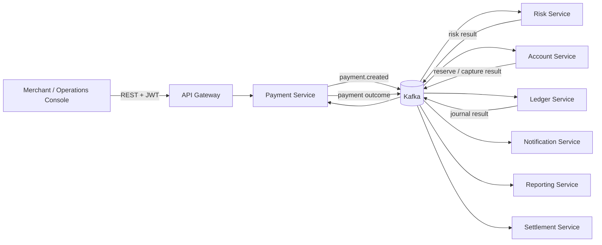

# PayFlow Payment Platform

PayFlow là một payment-platform backend dùng để trình bày cách xây hệ thống tài chính theo hướng
microservice, event-driven và có khả năng khôi phục lỗi. Dự án tập trung vào tính đúng đắn của tiền:
idempotency, state machine, Saga, transactional outbox/inbox, sổ cái kép, audit và phân quyền
deny-by-default.

> Đây là sandbox/portfolio project, không kết nối tiền thật. Email là adapter mock, payout chưa gọi
> ngân hàng/PSP thật và giao diện hiện tại là console kỹ thuật dành cho developer/operations.

## Luồng chính



REST nhận lệnh và trả kết quả đọc. Kafka không thay REST; nó nối các bước nội bộ dài và bất đồng bộ.
Mỗi service chỉ commit database của mình. Payment Service giữ Saga và phát command qua outbox; consumer
ghi inbox trước khi đổi state để event được giao lặp lại vẫn an toàn.

## Chức năng đã có

- Payment: tạo, tìm kiếm, xem chi tiết, hủy trước khi giữ tiền, refund và polling trạng thái.
- Financial workflow: risk → reserve → double-entry journal → capture → outcome; có compensation,
  retry hữu hạn, DLT và manual review.
- Operations: danh sách/duyệt manual review, danh sách/retry webhook DEAD.
- Merchant: profile, trạng thái, member, API key lifecycle và webhook HMAC configuration.
- Reporting, settlement và reconciliation read/operations API.
- Keycloak OAuth2/OIDC, Gateway authorization, service-level authorization và merchant ownership.
- PostgreSQL database riêng theo service, Redis cho risk/rate-limit, Kafka cho workflow event.

## Chạy nhanh trên Windows

Yêu cầu: Java 21 và Docker Desktop. PostgreSQL của Compose được publish ở `localhost:5433`, nên không
xung đột cổng mặc định `5432` của máy.

```powershell
Copy-Item .env.example .env
./payflow.ps1 rebuild
./payflow.ps1 smoke
```

`rebuild` dùng profile `full`, chuẩn bị secret local, provision các database/Keycloak client, build image
và đợi healthcheck. Những lần sau dùng `./payflow.ps1 start` để giữ cache và tránh build lại toàn bộ.

Sau khi hệ thống lên:

- Console: <http://localhost:8084/console.html>
- Swagger tổng: <http://localhost:8084/swagger-ui.html>
- Lấy merchant service token vào clipboard: `./payflow.ps1 token`
- Lấy operations token: `./payflow.ps1 token -Client operations`
- Xem trạng thái: `./payflow.ps1 status`
- Xem log: `./payflow.ps1 logs payment-service -Follow`
- Dừng nhưng giữ database: `./payflow.ps1 stop`

Console không lưu token vào localStorage; token ngắn hạn chỉ nằm trong memory của tab. Luồng đăng nhập
người dùng bằng Authorization Code + PKCE chưa phải phạm vi của console kỹ thuật này.

API key hiện mới có luồng cấp/thu hồi và lưu hash để hoàn thiện mô hình merchant. Gateway **chưa nhận
API key để xác thực request**; mọi API runtime hiện vẫn dùng Bearer JWT do Keycloak phát hành.

API key hiện mới có luồng cấp/thu hồi và lưu hash để hoàn thiện mô hình merchant. Gateway **chưa nhận
API key để xác thực request**; mọi API runtime hiện vẫn dùng Bearer JWT do Keycloak phát hành.

Nếu chỉ muốn kiểm tra code, không cần Docker:

```powershell
./mvnw.cmd -B -ntp -Pno-docker verify
```

Profile `mvp` giữ `account-ledger-service` gộp để minh họa lộ trình migration. Profile `full` là topology
được khuyến nghị: `account-service` và `ledger-service` tách database/deployable rõ ràng.

## Bản đồ source

| Nơi | Vai trò |
| --- | --- |
| `services/` | Các deployable Spring Boot; mỗi service sở hữu data và business boundary riêng |
| `libs/event-contracts` | Event name/version/payload dùng giữa producer và consumer |
| `libs/error-contract` | Problem Details và stable error code dùng chung |
| `libs/observability-support` | Correlation-ID convention, không chứa business code |
| `libs/network-security-support` | Kiểm tra outbound webhook URL chống SSRF, thuần Java |
| `infrastructure/` | Docker image, PostgreSQL bootstrap, Keycloak realm và script smoke/setup |
| `docs/api/` | OpenAPI mà Swagger ở Gateway phục vụ |
| `docs/architecture/` | Giải thích nghiệp vụ, công nghệ và đường đi cụ thể của code |
| `.docs/` | Quyết định, module ownership và evidence kỹ thuật trong quá trình xây dựng |

Điểm bắt đầu tốt nhất cho người đọc mới:

1. [Luồng nghiệp vụ và đường đi code](docs/architecture/current-business-code-flow-guide.md)
2. [REST khác Kafka ở đâu](docs/architecture/rest-kafka-flow-guide.md)
3. [Công nghệ và vị trí cấu hình](docs/architecture/technology-stack-configuration-guide.md)
4. [Runbook Docker full](docs/runbooks/phase3-code-first.md)
5. [Mục lục tài liệu](docs/README.md)

## Ranh giới và trạng thái xác minh

Không coi một capability là hoàn tất chỉ vì có class. Bảng evidence phân biệt `IMPLEMENTED`,
`VERIFIED_LOCAL`, `VERIFIED_CI` và `DEMO_READY` tại
[`.docs/IMPLEMENTATION_STATUS.md`](.docs/IMPLEMENTATION_STATUS.md).

Những phần có chủ đích chưa phải production integration: external PSP/acquirer, bank payout, email
provider thật, interactive customer login và Kubernetes deployment. Chúng được để ngoài core flow để
repository vẫn chạy local, có thể giải thích và kiểm thử được.
