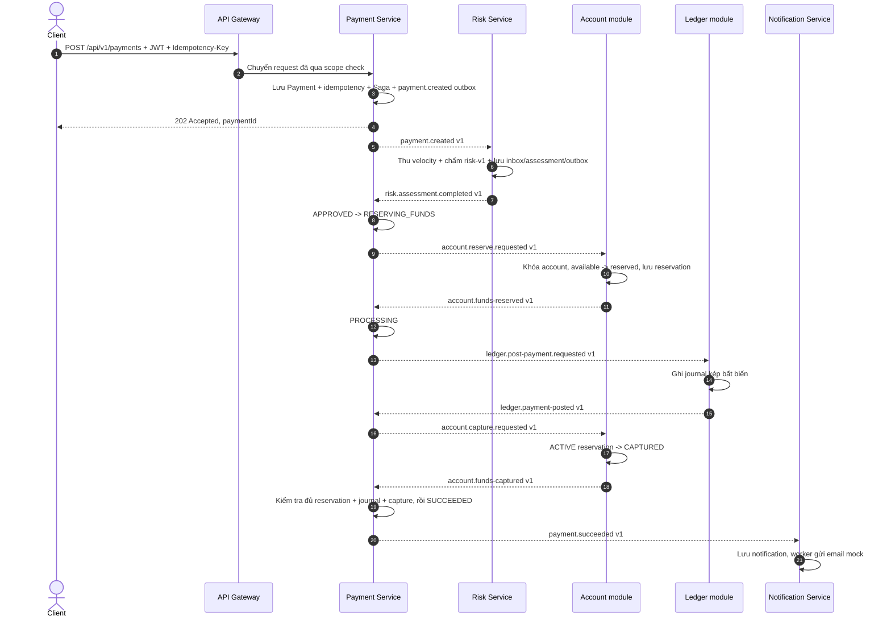
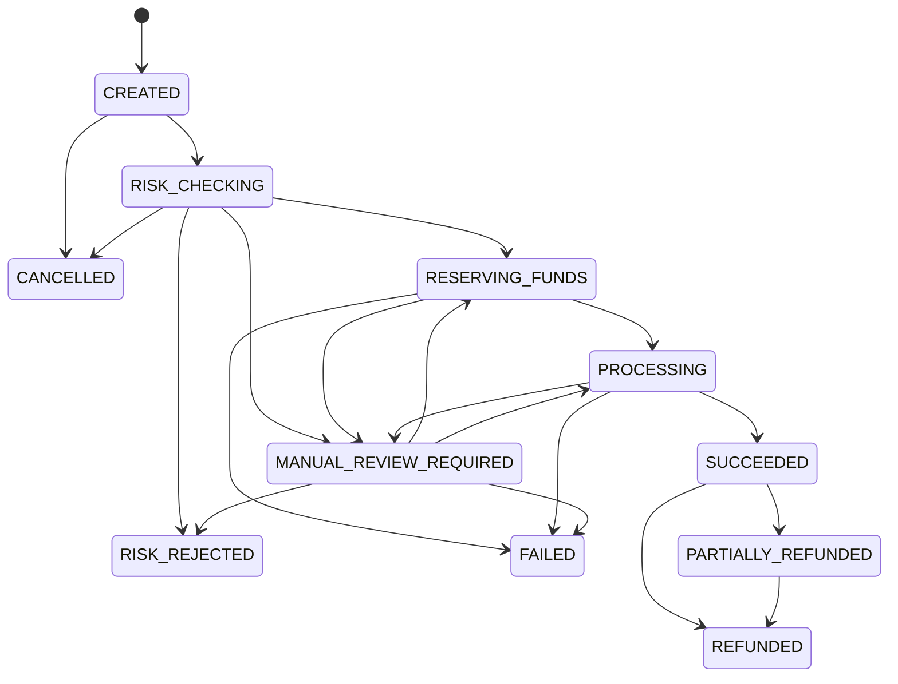
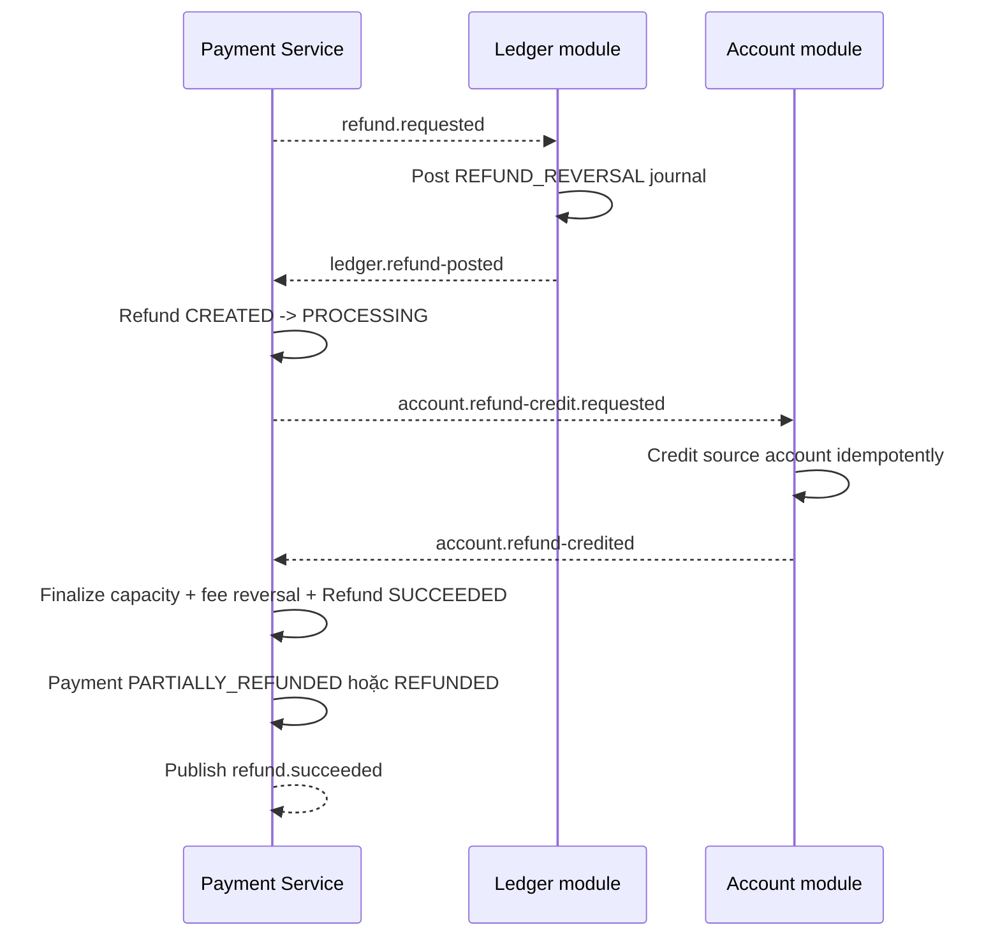

# PayFlow — nghiệp vụ, cấu hình xử lý và phương án thay thế

Tài liệu này giải thích PayFlow hiện xử lý một payment/refund như thế nào, vì sao hệ thống dùng các
phương pháp hiện tại, cấu hình nào được phép thay đổi khi chạy và những phương án thay thế hợp lý khi
hệ thống lớn hơn.

> Đây là **tài liệu tham chiếu**, không phải file rule engine có thể sửa để thay đổi nghiệp vụ lúc
> runtime. Những quy tắc liên quan đến tiền, trạng thái và tính idempotent phải tiếp tục được bảo vệ
> đồng thời trong domain code, database constraint, migration và test. Đưa các quy tắc đó vào một file
> YAML thứ hai sẽ tạo hai nguồn sự thật và có thể làm sai số dư.

## 1. Cách đọc trạng thái trong tài liệu

| Nhãn | Ý nghĩa |
| --- | --- |
| **Đang áp dụng** | Đã có trong code/contract hiện tại và có test không cần Docker tương ứng. |
| **Có code, chờ E2E hạ tầng** | Adapter/wiring đã có nhưng PostgreSQL, Kafka, Redis, Keycloak hoặc Docker thật chưa được chạy để chứng minh hành vi tích hợp. |
| **Chưa triển khai** | Có trong định hướng/spec nhưng chưa phải capability hiện tại. |

Nguồn xác nhận trạng thái cuối cùng là
[`IMPLEMENTATION_STATUS.md`](../../.docs/IMPLEMENTATION_STATUS.md). Một ADR được chấp nhận chỉ cho
phép triển khai quyết định; ADR không tự chứng minh runtime đã chạy đúng.

## 2. Bản đồ nghiệp vụ hiện tại

| Thành phần | Sở hữu nghiệp vụ/dữ liệu | Không sở hữu |
| --- | --- | --- |
| API Gateway | Xác thực JWT ở biên, kiểm tra scope, correlation ID, route Payment API | Payment state, số dư, journal |
| Payment Service | Payment, refund, idempotency response, immutable merchant-policy snapshot, Saga và điều phối workflow | Merchant master data, số dư account, journal kế toán, risk assessment |
| Account Service | Account/reservation, available/reserved balance, inbox/outbox | Payment state, journal, merchant, user identity |
| Ledger Service | Journal kép bất biến, payment/refund posting, inbox/outbox | Số dư khả dụng, Payment Saga, merchant policy hiện tại |
| Merchant Service | Merchant profile/status/member, versioned fee/limit policy, API key và webhook config | Payment state, số dư, journal |
| Risk Service | Risk assessment bền vững, policy `risk-v1`, velocity signal tạm thời trong Redis | Số dư, quyết định cuối cùng của Payment Saga |
| Notification Service | Notification record, email mock và durable signed webhook delivery/retry | Kết luận thanh toán; service chỉ phản ứng với outcome đã công bố |
| Reporting Service | Event log idempotent, merchant daily read model, generation rebuild và audit | Business source of truth hoặc mutation Payment/Account/Ledger |
| Keycloak | User/service identity, OAuth2/OIDC token, scope | Customer profile nghiệp vụ, account, payment |

Mỗi database service dùng database/credential riêng. Không service nào được đọc bảng hoặc JPA entity
của service khác. Profile `mvp` giữ `account-ledger-service` để demo tương thích; profile `full` thay nó
bằng `account-service` và `ledger-service` với database riêng. Payment đọc Merchant policy qua internal
REST có service token rồi lưu snapshot bất biến, không query chéo database.

Kiến trúc bên trong mỗi service theo hướng:

```text
REST API hoặc Kafka listener
        -> application handler/use case + local transaction
        -> domain model/policy + invariant
        -> port
        -> JPA/JDBC/Kafka/Redis/Keycloak adapter
```

Domain không phụ thuộc Spring, JPA, Kafka hay Redis. Đây là Hexagonal Architecture ở mức vừa đủ cho
nghiệp vụ tài chính; không bắt buộc mọi package nhỏ phải có đủ một bộ interface/adapter hình thức.

## 3. Luồng tạo payment hoàn chỉnh

### 3.1 Luồng thành công



Điểm quan trọng:

- API chỉ xác nhận **đã tiếp nhận** bằng HTTP `202`; client dùng `GET /api/v1/payments/{paymentId}` để
  theo dõi trạng thái bất đồng bộ.
- Không có distributed transaction. Mỗi mũi tên Kafka là một local transaction độc lập có
  Outbox/Inbox bảo vệ.
- Payment chỉ thành `SUCCEEDED` sau khi cả journal đã `POSTED` và reservation đã `CAPTURED`.
- Nếu journal đã post nhưng capture chưa xác định, hệ thống không tự release tiền; Saga chuyển sang
  xử lý/retry có giới hạn hoặc `MANUAL_REVIEW_REQUIRED`.

### 3.2 Tiếp nhận, tenant isolation và idempotency

**Đang áp dụng:**

1. Gateway và Payment Service đều xác thực JWT; `payment:write` dùng cho POST, `payment:read` dùng cho
   GET.
2. `merchant_id` lấy từ JWT, không tin `merchantId` do body gửi lên. Query/read cũng scope theo
   merchant để tránh đọc chéo tenant.
3. `Idempotency-Key` là bắt buộc cho create payment và refund. Scope gồm merchant và endpoint.
4. Payload được canonicalize rồi fingerprint. Cùng key + cùng payload trả lại response cũ; cùng key +
   payload khác trả `409 Conflict`.
5. Record idempotency, Payment, Saga và outbox đầu tiên được ghi trong cùng local transaction. Thời
   hạn record hiện tại là 24 giờ.
6. Khi hai request cùng key chạy đồng thời, unique index PostgreSQL chọn một winner; request còn lại
   đọc lại response đã lưu thay vì tạo payment thứ hai.

**Lý do chọn:** idempotency nằm trong PostgreSQL cùng business record nên không xuất hiện cửa sổ
“Redis ghi thành công nhưng Payment rollback”, đồng thời response replay bền vững qua restart.

**Phương án thay thế:**

- Redis idempotency cho tốc độ cao hơn, nhưng cần giải quyết mất cache, consistency với PostgreSQL và
  cách khôi phục response; chỉ phù hợp làm lớp fast-path phía trước nguồn sự thật bền vững.
- Chỉ dựa vào UUID do client sinh là chưa đủ vì không phát hiện cùng key nhưng payload khác và không
  lưu được response replay.
- Distributed lock làm hệ thống phức tạp hơn unique constraint, trong khi bài toán hiện tại đã có một
  database owner duy nhất.

### 3.3 Payment state machine



Mọi chuyển trạng thái phải đi qua domain model. Các trạng thái terminal hiện tại là
`RISK_REJECTED`, `FAILED`, `CANCELLED`, `REFUNDED`. `SUCCEEDED` chưa terminal vì vẫn có thể refund.
State machine đã hỗ trợ `CANCELLED`, nhưng public cancel API/use case **chưa triển khai**.

## 4. Risk assessment

### 4.1 Policy `risk-v1`

Risk engine hiện là rule engine deterministic. Các rule chạy theo thứ tự cố định để danh sách
`matchedRules` luôn ổn định:

| Rule | Điều kiện hiện tại | Điểm |
| --- | --- | ---: |
| `AMOUNT_HIGH` | `amount >= 10,000,000.0000` | 30 |
| `VELOCITY_1M` | Số payment trong 1 phút `> 5` | 40 |
| `VELOCITY_1H` | Tổng amount trong 1 giờ `> 30,000,000.0000` | 35 |
| `NEW_DEVICE` | Thiết bị mới | 10 |
| `FAILED_BURST` | Payment thất bại trong 10 phút `>= 3` | 25 |
| `MERCHANT_SUSPICIOUS` | Merchant bị đánh dấu đáng ngờ | 50 |
| `IP_CHANGE` | Quốc gia IP thay đổi | 20 |

Tổng điểm được chặn bằng `min(rawScore, 100)`:

| Score | Level | Decision |
| ---: | --- | --- |
| 0–19 | `LOW` | `APPROVED` |
| 20–39 | `MEDIUM` | `APPROVED` |
| 40–69 | `HIGH` | `REVIEW_REQUIRED` |
| 70–100 | `CRITICAL` | `REJECTED` |

`APPROVED` mới được reserve tiền. `REJECTED` kết thúc bằng `RISK_REJECTED` và outcome failure.
`REVIEW_REQUIRED` chuyển Payment/Saga sang `MANUAL_REVIEW_REQUIRED`, không đụng tới số dư.

### 4.2 PostgreSQL và Redis được dùng khác nhau

- PostgreSQL lưu assessment/inbox/outbox và là nguồn sự thật bền vững.
- Redis chỉ lưu velocity window. Lua script cập nhật counter/amount atomically; `paymentId` làm member
  để delivery trùng không tăng counter lần hai.
- Amount velocity được lưu dưới dạng chuỗi decimal theo minor-unit logic, không cộng bằng floating
  point.
- Retention mặc định là 2 giờ.
- Event `payment.created v1` hiện chỉ cung cấp đủ amount/customer cho các rule velocity. Bốn signal
  `newDevice`, `failedPaymentsLastTenMinutes`, `merchantSuspicious`, `ipCountryChanged` hiện nhận giá
  trị neutral (`false`/`0`) cho tới khi có contract enrichment versioned.

**Phương án thay thế:**

- Drools/DMN phù hợp khi nghiệp vụ cần business user sửa nhiều rule và audit version, nhưng tăng độ
  phức tạp deploy/debug. Với bảy rule cố định, code thuần Java dễ test và dễ giải thích hơn.
- ML fraud model phù hợp khi đã có dữ liệu nhãn, feature store, model monitoring và fallback. Dự án
  hiện chưa có dữ liệu đủ để một model đáng tin hơn rule deterministic.
- Chỉ dùng SQL counter giúp giảm một dependency nhưng lock/query theo time window nặng hơn. Redis phù
  hợp với signal tạm thời; tuyệt đối không dùng Redis làm nguồn sự thật số dư.

## 5. Account và reservation

### 5.1 Invariant số dư

Mọi amount dùng `BigDecimal` trong Java và `NUMERIC(19,4)` trong PostgreSQL. Currency bắt buộc và hai
amount khác currency không được cộng/trừ. MVP hiện khóa dữ liệu runtime vào VND.

Account có `ACTIVE`, `FROZEN`, `CLOSED`. Reserve yêu cầu account `ACTIVE`, amount dương, cùng currency,
deadline còn hiệu lực và đủ `available_balance`:

```text
reserve:  available -= amount; reserved += amount
capture:  reserved  -= amount; available giữ nguyên vì đã trừ lúc reserve
release:  reserved  -= amount; available += amount
```

`available_balance >= 0` và `reserved_balance >= 0` được bảo vệ ở domain lẫn database constraint.
Mỗi payment chỉ có một reservation nghiệp vụ. Reservation đi từ `ACTIVE` sang đúng một trạng thái
terminal: `CAPTURED`, `RELEASED` hoặc `EXPIRED`; duplicate cùng intent trả kết quả ổn định.

Refund credit được phép với account `ACTIVE` hoặc `FROZEN`, nhưng không credit account `CLOSED`.

### 5.2 Concurrency hiện tại

Account được đọc với `PESSIMISTIC_WRITE` trước khi kiểm tra và cập nhật số dư. Reservation cũng được
khóa khi capture/release. Cách này serialize các thao tác cạnh tranh trên cùng một account và tránh
race “cả hai request đều thấy đủ tiền”.

**Phương án thay thế:**

- Conditional atomic update (`UPDATE ... SET ... WHERE available_balance >= ?`) có throughput tốt và
  ít giữ lock hơn, nhưng phải thiết kế kỹ affected-row semantics và đồng bộ việc tạo reservation.
- Optimistic locking (`@Version`) phù hợp khi contention thấp; khi nhiều request cùng tranh một
  account, retry conflict có thể làm tail latency cao.
- Distributed lock bằng Redis không cần thiết vì PostgreSQL đã là owner của số dư; thêm lock ngoài DB
  tạo thêm failure mode mà constraint trong DB vẫn phải giữ.

## 6. Ledger kép bất biến

Payment capture tạo journal `PAYMENT_CAPTURE`: debit customer ledger account, credit merchant ledger
account. Refund tạo journal `REFUND_REVERSAL`: debit merchant, credit customer.

Trước khi post, domain bắt buộc:

- ít nhất hai entry;
- có cả `DEBIT` và `CREDIT`;
- amount mỗi entry dương và cùng currency;
- tổng debit bằng tổng credit;
- idempotent theo `(reference_type, reference_id, journal_type)`.

Journal `POSTED` không update và không hard-delete. Sai sót phải sửa bằng reversal/new journal để giữ
dấu vết kế toán.

**Phương án thay thế:**

- Chỉ cập nhật balance là dễ làm demo nhưng không trả lời được “tiền đã đi đâu” và khó reconciliation.
- Journal mutable làm mất audit trail và khiến retry khó phân biệt correction với ghi đè.
- Một ledger engine chuyên dụng có thể phù hợp ở quy mô lớn, nhưng cần contract/operational maturity;
  MVP giữ ledger nội bộ để thể hiện rõ invariant và failure window.

## 7. Saga, compensation và manual review

Payment Service là Saga orchestrator. Trình tự step:

```text
RISK_ASSESSMENT -> RESERVE_FUNDS -> POST_LEDGER -> CAPTURE_FUNDS -> COMPLETED
```

Saga lưu status, step, deadline, retry count, error code, `reservationId` và `journalId`. Scheduler tìm
Saga quá hạn theo batch, retry hữu hạn và dùng version/conditional persistence để tránh hai worker
cùng thắng.

Nguyên tắc recovery:

- Trước khi journal post: failure sau reserve có thể phát `account.release.requested` để bù trừ.
- Sau khi journal đã post: **không tự release reservation**, vì journal nói tiền đã được ghi nhận. Capture
  ambiguity phải retry/reconcile hoặc vào `MANUAL_REVIEW_REQUIRED`.
- Không để `PROCESSING` vô hạn và không tuyên bố end-to-end exactly-once.

**Phương án thay thế:**

| Phương pháp | Khi phù hợp | Vì sao chưa chọn |
| --- | --- | --- |
| Chuỗi REST đồng bộ | Workflow ngắn, ít failure window, caller cần kết quả ngay | Timeout dây chuyền, coupling cao và vẫn không rollback được nhiều database |
| Distributed 2PC/XA | Ít hệ thống đồng nhất, coordinator đáng tin và chấp nhận coupling | Kafka/service database độc lập không phù hợp; vận hành nặng và giảm autonomy |
| Saga choreography hoàn toàn | Nhiều team tự quản, workflow đơn giản và phản ứng sự kiện rõ | Khó nhìn toàn bộ trạng thái/timeout; Payment là owner tự nhiên của quyết định cuối |
| Workflow engine như Temporal/Camunda | Workflow rất dài, nhiều timer/human task và cần UI vận hành | Thêm platform lớn; Saga persisted hiện đủ cho phạm vi portfolio MVP |

## 8. Refund

### 8.1 Intake và chống over-refund

`POST /api/v1/payments/{paymentId}/refunds` yêu cầu JWT merchant, `Idempotency-Key` và payment thuộc
merchant đó. Payment phải ở `SUCCEEDED` hoặc `PARTIALLY_REFUNDED`.

Capacity khả dụng được tính như sau:

```text
refundable = original amount - succeeded refund total - in-flight reserved refund total
```

Trong transaction intake, Payment được khóa trước rồi mới đọc/khóa Refund theo thứ tự cố định. Amount
refund được reserve atomically vào in-flight capacity trước khi trả `202`. Nếu refund fail trước điểm
không thể đảo ngược, capacity được release; nếu thành công, reserved capacity chuyển sang succeeded
total. Database không cho tổng hai giá trị vượt original amount.

### 8.2 Thứ tự xử lý tài chính



Nếu ledger fail trước khi có journal, Refund có thể thành `FAILED` và release capacity. Sau khi journal
đã `POSTED`, Refund không được tự chuyển `FAILED`/hoàn tác bằng cách sửa journal; ambiguity cần manual
handling/reconciliation.

### 8.3 Fee snapshot và hoàn phí

Tại payment intake, Payment đóng băng `policyVersion`, rate scale tối đa 6, `HALF_UP` và fee amount ở
scale tiền 4. Giao dịch cũ không bao giờ tính lại theo merchant fee hiện tại.

Partial refund reverse fee theo tỷ lệ **lũy kế** để sai số làm tròn không cộng dồn. Mỗi refund chỉ nhận
delta so với cumulative reversal trước đó; full refund bắt buộc reverse đúng toàn bộ fee gốc.

**Phương án thay thế:** tính fee riêng trên từng refund đơn giản hơn nhưng nhiều partial refund có thể
làm tổng rounding lệch fee ban đầu. Đọc fee policy hiện tại khi refund là sai lịch sử.

## 9. Messaging reliability

### 9.1 Transactional Outbox

Business mutation và outbox row được ghi trong cùng local transaction. Publisher:

1. claim một batch trong transaction ngắn bằng owner + lease;
2. commit rồi mới gọi Kafka;
3. mark `PUBLISHED` có điều kiện theo owner;
4. reclaim claim hết lease, retry exponential backoff hữu hạn, cuối cùng thành `FAILED`.

Mặc định: poll `500ms`, batch `100`, lease `120s`, Kafka delivery timeout `60s`, tối đa 10 attempt và
backoff cap `300s`. Trong một batch, event sau của cùng aggregate bị dời retry khi event trước lỗi;
ordering nhiều replica vẫn cần được chứng minh bằng Kafka/PostgreSQL E2E.

Crash sau Kafka send nhưng trước khi mark DB có thể publish trùng. Đó là hành vi at-least-once có chủ
đích, không phải exactly-once.

**Thay thế:**

- Publish trực tiếp sau DB commit có cửa sổ mất event nếu process chết.
- Publish trước commit có thể phát event cho dữ liệu đã rollback.
- Debezium CDC giảm polling và tách publisher khỏi app, phù hợp giai đoạn scale sau; đổi lại cần Kafka
  Connect, schema/change-event governance và vận hành phức tạp hơn.
- Kafka transaction không tự biến transaction PostgreSQL + Kafka thành một atomic transaction.

### 9.2 Transactional Inbox

Consumer dùng khóa `(event_id, consumer_name)` và
`INSERT ... ON CONFLICT DO NOTHING`. Chỉ delivery đầu tiên được thay đổi business state và append
outbox trong cùng transaction. Kafka offset chỉ acknowledge sau khi transaction trả về thành công.

Listener retry lỗi transient hữu hạn rồi chuyển poison event sang `payflow.dead-letter.v1`; replay phải
đi qua runbook và vẫn an toàn nhờ inbox/idempotency.

**Thay thế:** Redis dedup nhanh nhưng không atomic với PostgreSQL business mutation. Kafka EOS chỉ bao
phủ đầy đủ Kafka-to-Kafka; với side effect PostgreSQL, durable inbox vẫn là ranh giới rõ ràng hơn.

### 9.3 Topic/key hiện tại

Event envelope có `eventId`, type/version, aggregate type/id, correlation, causation, producer và
timestamp. Kafka key là `paymentId`/aggregate ID để giữ thứ tự theo aggregate, không giả định thứ tự
toàn cục.

Topic được tổ chức theo **producer context**. Vì vậy Payment Service có thể phát command
`account.reserve.requested` hoặc `ledger.post-payment.requested` trên `payflow.payment.events.v1`;
Account, Ledger và Risk phát outcome trên topic context của chúng. Consumer route bằng event type và
version, không suy ra ý nghĩa chỉ từ tên topic.

## 10. Notification

Notification Service consume `payment.succeeded`, `payment.failed`, `refund.succeeded` và
`refund.failed`. Inbox record và Notification được ghi atomically. Unique business source/channel
chặn tạo hai notification cho cùng outcome.

Worker dùng claim/lease, gọi provider ngoài transaction rồi conditional finalize. Mặc định poll
`500ms`, batch `50`, lease `30s` và tối đa 5 lần claim/reclaim. Provider throw/trả failure hiện bị
đánh dấu `FAILED` ngay; chưa có retry schedule cho provider failure. `providerTimeout=5s` đã nằm trong
typed policy nhưng chưa bọc lời gọi adapter; adapter hiện là in-memory mock, trả ngay và dedup theo
`notificationId`.

Với webhook, cùng transaction intake còn tạo durable intent nếu Merchant subscribe event đó. Worker ký
`timestamp.rawBody` bằng HMAC SHA-256, gọi HTTP ngoài transaction với connect/read timeout, rồi cập nhật
attempt bằng lease ownership. Retry giữ nguyên `eventId` và raw body; hết lịch chuyển `DEAD`. Operations
API chỉ requeue bản ghi `DEAD`, dùng scope riêng và ghi append-only audit.

**Có code, chờ E2E hạ tầng:** Kafka consumer, PostgreSQL persistence, email worker, signed webhook HTTP,
retry/`DEAD` và audited manual requeue. Email provider thật vẫn chưa triển khai. Direct-send ngay trong
Kafka listener không được chọn vì provider chậm/down sẽ giữ consumer transaction và làm payment outcome
bị coupling với email.

## 11. Security và quản lý người dùng

- Keycloak quản lý danh tính, client credentials và scope. PayFlow hiện không có `user-service` riêng.
- `customerId` là tham chiếu nghiệp vụ trong payment/account flow, không phải hồ sơ đăng nhập.
- Gateway và Payment Service đều validate JWT; downstream không tin identity header do client tự gửi.
- Account, Ledger và Risk chỉ public health endpoint. Notification chỉ thêm operations webhook endpoint
  có scope riêng; các HTTP path còn lại deny by default.
- Error API dùng Problem Details với stable code/correlation ID, không trả stack trace/SQL/secret.
- Secret chỉ đi qua environment; `.env.example` chứa placeholder cho local sandbox.

**Phương án thay thế:** custom auth cho quyền kiểm soát cao nhưng dễ sai ở token lifecycle/rotation;
managed IdP giảm vận hành nhưng tạo chi phí/vendor dependency; API key phù hợp server-to-server đơn
giản nhưng không thay thế đầy đủ user identity và scoped authorization. Keycloak là lựa chọn cân bằng
cho portfolio local.

## 12. Ma trận cấu hình runtime

Giá trị đầy đủ nằm trong [`.env.example`](../../.env.example). Bảng này giải thích tác động nghiệp vụ,
không chứa credential thật.

| Nhóm biến | Mặc định local | Tác động |
| --- | --- | --- |
| `PAYFLOW_*_DB_URL/USERNAME/PASSWORD` | DB/credential riêng từng service | Giữ database-per-service; không dùng chung credential để “chạy cho nhanh”. |
| `PAYFLOW_OIDC_ISSUER_URI`, `PAYFLOW_OIDC_JWK_SET_URI` | Keycloak local `:8180` | Tách public issuer và private JWK URL khi app chạy trong Compose. |
| `PAYFLOW_KAFKA_BOOTSTRAP_SERVERS` | `localhost:9092` | Broker cho workflow bất đồng bộ. |
| `PAYFLOW_REDIS_HOST/PORT/TIMEOUT` | `localhost:6379`, `2s` | Risk velocity; Redis lỗi không được biến thành nguồn số dư thay thế. |
| `PAYFLOW_OUTBOX_ENABLED` | `true` | Bật publisher ở Payment, Account-Ledger, Risk. `false` vẫn để business + pending outbox commit để drain sau. |
| `PAYFLOW_OUTBOX_POLL_INTERVAL/BATCH_SIZE` | `500ms` / `100` | Độ trễ và tải mỗi vòng publisher. |
| `PAYFLOW_OUTBOX_LEASE` | `120s` | Phải dài hơn Kafka delivery timeout để hạn chế claim trùng đang còn publish. |
| `PAYFLOW_OUTBOX_MAX_ATTEMPTS/MAX_BACKOFF` | `10` / `300s` | Giới hạn retry và backoff terminal. |
| `PAYFLOW_KAFKA_DELIVERY_TIMEOUT_MS` | `60000` | Bound cho network publish và guard của outbox lease; phải lớn hơn tổng Kafka request timeout và linger. |
| `PAYFLOW_WORKFLOW_CONSUMER_ENABLED` | `true` | Bật Payment consumer cho Risk/Account/Ledger outcomes. |
| `PAYFLOW_WORKFLOW_CONSUMER_RETRY_BACKOFF/MAX_RETRIES` | `1s` / `3` | Retry listener Payment trước DLT. |
| `PAYFLOW_SAGA_RECOVERY_ENABLED` | `true` | Bật scheduler xử lý Saga quá hạn. |
| `PAYFLOW_SAGA_RECOVERY_POLL_INTERVAL` | `1s` | Chu kỳ quét deadline. |
| `PAYFLOW_SAGA_STEP_TIMEOUT/MAX_RETRIES/BATCH_SIZE` | `30s` / `3` / `50` | Timeout, retry và giới hạn mỗi vòng recovery. |
| `PAYFLOW_PAYMENT_CONSUMER_ENABLED` | `true` | Account-Ledger (profile `mvp`) consume payment commands. |
| `PAYFLOW_REFUND_CONSUMER_ENABLED` | `true` | Account-Ledger (profile `mvp`) consume refund commands. |
| `PAYFLOW_ACCOUNT_CONSUMER_ENABLED` | `true` | Account Service (profile `full`) consume payment topic; account không nghe refund topic. |
| `PAYFLOW_LEDGER_CONSUMER_ENABLED` | `true` | Ledger Service (profile `full`) consume cả payment và refund topic. |
| `PAYFLOW_MERCHANT_CATALOG_MODE` | `remote` | `remote` = Payment gọi REST nội bộ sang Merchant Service; `local` = đọc bảng snapshot `merchant` trong DB Payment. Không có fallback từ `remote` sang `local`. |
| `PAYFLOW_RISK_CONSUMER_ENABLED` | `true` | Risk consume `payment.created`. |
| `PAYFLOW_RISK_VELOCITY_RETENTION` | `2h` | Thời gian giữ signal velocity Redis. |
| `PAYFLOW_NOTIFICATION_CONSUMER_ENABLED` | `true` | Consume payment/refund outcomes. |
| `PAYFLOW_NOTIFICATION_DELIVERY_ENABLED` | `true` | Bật email delivery worker. |
| `PAYFLOW_NOTIFICATION_POLL_INTERVAL/BATCH_SIZE` | `500ms` / `50` | Nhịp và batch của worker. |
| `PAYFLOW_NOTIFICATION_LEASE/PROVIDER_TIMEOUT/MAX_ATTEMPTS` | `30s` / `5s` / `5` | Lease phải lớn hơn timeout; `maxAttempts` hiện giới hạn claim/reclaim sau crash. Provider timeout/retry network đầy đủ chưa được wire. |
| `PAYFLOW_WEBHOOK_*` | timeout/lease/retry worker cho Notification | Giữ HTTP call ngoài DB transaction, retry bounded và stable signed payload. |
| `PAYFLOW_MERCHANT_DB_*`, `PAYFLOW_MERCHANT_CLIENT_*` | Merchant DB và internal OAuth client | Payment/Notification gọi Merchant qua authenticated REST; lỗi dependency fail closed, không đọc DB chéo. |
| `PAYFLOW_MERCHANT_ENCRYPTION_KEY_BASE64` | secret local do script sinh | Mã hóa webhook signing secret at rest; không commit hoặc log giá trị. |
| `PAYFLOW_REPORTING_DB_*`, `PAYFLOW_REPORTING_CONSUMER_ENABLED` | Reporting DB/consumer | Bật event-log projection và generation-based rebuild độc lập source service. |
| `SPRING_PROFILES_ACTIVE=local` | Chỉ bật khi chạy local | Nạp deterministic merchant/account/ledger seed qua Flyway callback; không dùng ở môi trường thật. |

Các switch consumer/publisher giúp cô lập service khi debug. Tắt một switch không phải chế độ E2E hợp
lệ: workflow sẽ dừng ở pending outbox hoặc một trạng thái trung gian cho tới khi thành phần được bật
lại.

Risk, Account-Ledger, Account, Ledger, Reporting và Notification listener hiện dùng retry cố định `1s`,
3 lần trước shared DLT trong code; chỉ Payment workflow đã expose backoff/max retry qua environment. Nếu cần điều chỉnh đồng
bộ ở nhiều môi trường, nên chuẩn hóa thành typed configuration ở một change riêng kèm test.

## 13. Bảng quyết định phương pháp tổng hợp

| Bài toán | Đang dùng | Phương án thay thế đáng cân nhắc | Trigger để đổi |
| --- | --- | --- | --- |
| Boundary dữ liệu | Database/credential riêng service | Shared DB/schema | Không khuyến nghị; chỉ hợp prototype rất ngắn và làm mất ownership |
| Account + Ledger deployment | Một service, hai module/schema | Tách hai deployable | Team/scale/SLA khác nhau và đã có E2E/recovery ổn định |
| Workflow phân tán | Orchestrated Saga | REST chain, choreography, workflow engine, 2PC | Đổi khi độ dài workflow/team ownership vượt khả năng Saga hiện tại |
| DB → Kafka | Polling Transactional Outbox | Debezium CDC | Outbox volume/latency và vận hành Kafka Connect đủ chín |
| Consumer dedup | PostgreSQL Inbox | Kafka EOS, Redis dedup | Chỉ đổi nếu side effect không còn nằm ở PostgreSQL hoặc có bằng chứng atomic tương đương |
| Reserve/refund concurrency | Pessimistic row lock | Conditional update, optimistic lock | Contention/latency đo được cho thấy lock là bottleneck |
| Accounting | Immutable double-entry journal | External ledger engine | Nhu cầu multi-currency, settlement/reconciliation lớn và platform team sẵn sàng |
| Fraud | Java rules + Redis velocity | DMN/Drools, ML model | Rule thay đổi thường xuyên hoặc có dữ liệu/model governance thật |
| Identity | Keycloak OIDC | Managed IdP, custom auth, API keys | Nhu cầu production SLA/compliance hoặc mô hình tích hợp thay đổi |
| Notification | Persistent record + lease worker | Provider queue/webhook platform | Có provider thật, SLA và multi-channel cần scale độc lập |
| Runtime deployment | Docker Compose local | Kubernetes | Chỉ sau khi Docker E2E, health, observability và failure gate đã xanh |

## 14. Những gì chưa nên hiểu nhầm là đã hoàn thành

- Docker Compose mới được render/validate phía client; container chưa được start trong evidence hiện
  tại.
- PostgreSQL/Kafka/Redis/Keycloak runtime và Testcontainers E2E vẫn cần chạy khi Docker được bật.
- Email hiện là mock; settlement, reconciliation, Kubernetes, load test và full observability stack
  chưa phải capability hoàn thành.
- Payment search/refund lookup và manual-review resolution đã có; public merchant cancel, user profile
  service và customer-facing login UI chưa có.
- `account-service`/legacy `account-ledger-service` không quản lý user; chúng chỉ quản lý account
  balance/reservation. `ledger-service` chỉ quản lý journal/posting.
- Không được ghi “exactly once”. Mô hình là at-least-once delivery + idempotent consumer + database
  invariant.

## 15. Cách trình bày ngắn khi phỏng vấn

> PayFlow nhận payment theo API idempotent và trả 202. Payment Service điều phối Saga qua Kafka: Risk
> chấm rule deterministic, Account khóa hàng để reserve, Ledger post journal kép bất biến, sau đó
> Account capture và Payment mới công bố success. Mỗi service có database riêng; Outbox ngăn mất event,
> Inbox chống xử lý trùng, còn retry/compensation/manual review xử lý failure window. Refund khóa
> Payment để reserve capacity, post reversal journal rồi mới credit account và finalize. Hệ thống không
> giả vờ có distributed exactly-once; tính đúng được giữ bằng idempotency, state machine, lock,
> constraint và reconciliation boundary.

## 16. Nguồn code và quyết định để đọc sâu

- [Payment REST controller](../../services/payment-service/src/main/java/com/payflow/payment/api/PaymentController.java)
- [Payment state machine](../../services/payment-service/src/main/java/com/payflow/payment/domain/model/PaymentStatus.java)
- [Payment Saga](../../services/payment-service/src/main/java/com/payflow/payment/domain/model/PaymentSaga.java)
- [Payment intake handler](../../services/payment-service/src/main/java/com/payflow/payment/application/handler/CreatePaymentHandler.java)
- [Refund intake handler](../../services/payment-service/src/main/java/com/payflow/payment/application/handler/CreateRefundHandler.java)
- [Fee snapshot](../../services/payment-service/src/main/java/com/payflow/payment/domain/model/PaymentFeeSnapshot.java)
- [Account model](../../services/account-service/src/main/java/com/payflow/account/domain/model/Account.java)
- [Account row-lock adapter](../../services/account-service/src/main/java/com/payflow/account/infrastructure/persistence/JpaAccountReservationStore.java)
- [Immutable Journal model](../../services/ledger-service/src/main/java/com/payflow/ledger/domain/model/Journal.java)
- [Merchant application service](../../services/merchant-service/src/main/java/com/payflow/merchant/application/MerchantApplicationService.java)
- [Reporting projection handler](../../services/reporting-service/src/main/java/com/payflow/reporting/application/ReportingProjectionHandler.java)
- [Risk rule engine](../../services/risk-service/src/main/java/com/payflow/risk/domain/policy/RiskRuleEngine.java)
- [Redis risk signals](../../services/risk-service/src/main/java/com/payflow/risk/infrastructure/redis/RedisRiskSignalProvider.java)
- [Notification delivery policy](../../services/notification-service/src/main/java/com/payflow/notification/application/delivery/NotificationDeliveryPolicy.java)
- [Kafka topic constants](../../libs/event-contracts/src/main/java/com/payflow/events/PayFlowTopics.java)
- [OpenAPI v1](../api/payment-service-v1.yaml)
- [ADR index](../adr/README.md)
- [Docker MVP runbook](../runbooks/mvp-docker.md)
