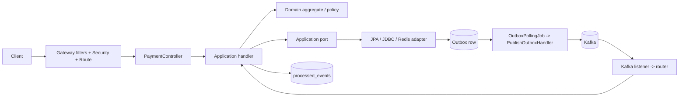

# PayFlow — bản đồ source code và luồng thực thi

Tài liệu này trả lời câu hỏi: **một HTTP request hoặc Kafka event đi qua những class nào, class nào
được phép làm gì, transaction nằm ở đâu và nên đặt code mới vào thư mục nào?**

Đọc nghiệp vụ trước ở
[`business-processing-reference.md`](business-processing-reference.md). File đó giải thích *hệ thống
làm gì và vì sao*; file này giải thích *source code thực hiện việc đó như thế nào*.

> Trạng thái runtime hiện tại: code và test không cần Docker đã có; PostgreSQL/Kafka/Redis/Keycloak
> thật vẫn chờ E2E. Xem bằng chứng tại
> [`IMPLEMENTATION_STATUS.md`](../../.docs/IMPLEMENTATION_STATUS.md). Sơ đồ dưới đây mô tả wiring
> hiện có trong code, không tuyên bố hạ tầng đã được kiểm chứng.

## 1. Bức tranh code trong hai phút



Có hai entry point:

1. **Đồng bộ:** Gateway → Payment Controller → application handler → domain → persistence → HTTP
   response.
2. **Bất đồng bộ:** Kafka listener → event router → transactional application handler → domain
   policy → inbox/business data/outbox → listener acknowledge.

Controller và listener đều mỏng. Chúng không được gọi repository trực tiếp. Application handler là
nơi điều phối use case và mở local transaction; domain là nơi từ chối trạng thái/amount không hợp lệ;
adapter là nơi biết JPA, JDBC, Kafka hoặc Redis.

## 2. Monorepo được bố trí như thế nào

```text
payflow-payment-platform/
├── libs/
│   ├── event-contracts/          # envelope, event type và DTO dùng giữa service
│   ├── error-contract/           # Problem Details/error convention dùng chung
│   └── observability-support/    # correlation-id helper
├── services/
│   ├── api-gateway/              # WebFlux edge, không chứa business state
│   ├── payment-service/          # REST, Payment/Refund aggregate, Saga orchestrator
│   ├── account-ledger-service/   # Account và Ledger trong một deployable MVP
│   ├── risk-service/             # rule engine + Redis velocity + assessment
│   └── notification-service/     # outcome projection + email mock worker
├── infrastructure/               # Docker, Keycloak, PostgreSQL init, smoke script
├── docs/                         # tài liệu bàn giao, contract, ADR, runbook
└── .docs/                        # roadmap/status/guidance cho quá trình xây dựng
```

Root [`pom.xml`](../../pom.xml) chỉ quản lý module, version/dependency và test profile. Business code
không nằm ở root hoặc shared library.

`event-contracts` chỉ chứa contract ổn định như
[`EventEnvelope`](../../libs/event-contracts/src/main/java/com/payflow/events/EventEnvelope.java),
[`PayFlowTopics`](../../libs/event-contracts/src/main/java/com/payflow/events/PayFlowTopics.java) và
các `*Data` record. Nó không chứa aggregate, repository hoặc business service dùng chung.

## 3. Ý nghĩa từng loại package/class

| Vị trí/tên class | Vai trò | Có được biết Spring/JPA/Kafka không? |
| --- | --- | --- |
| `api/*Controller` | Nhận HTTP, lấy JWT/header, map request → command, map result → response | Có Spring Web/Security, không truy cập DB |
| `api/request`, `api/response` | Contract HTTP và Bean Validation | Có Jakarta Validation, không dùng entity |
| `application/command` | Input đã gồm context do server xác thực | Java thuần |
| `application/handler/*Handler` | Một use case; điều phối port/domain và transaction | Có thể dùng Spring transaction |
| `application/*Policy`, `*Factory` | Quyết định deterministic hoặc tạo contract output | Nên Java thuần, không I/O |
| `application/port/*` | Interface mà use case cần từ bên ngoài | Không biết adapter cụ thể |
| `domain/model` | Aggregate/value object/state machine/invariant | Chỉ Java standard library |
| `domain/exception` | Lỗi nghiệp vụ có nghĩa ổn định | Không phụ thuộc transport |
| `infrastructure/persistence` | JPA entity, JDBC/JPA implementation của port | Biết PostgreSQL/JPA/Jackson |
| `infrastructure/messaging` | Kafka listener/router/outbox transport/polling | Biết Spring Kafka |
| `infrastructure/security` | Resource Server và deny-by-default | Biết Spring Security |
| `infrastructure/config` | Biến environment → typed properties/bean wiring | Biết Spring Configuration |
| `src/main/resources/db/migration` | Schema, constraint, index do Flyway sở hữu | PostgreSQL SQL |
| `src/test` | Unit, web slice, persistence/messaging integration | Chứng minh đúng layer tương ứng |

Quy tắc hướng phụ thuộc:

```text
api/listener -> application -> domain
infrastructure -> application port + domain
domain -X-> Spring/JPA/Kafka/Redis
```

Infrastructure implement interface nằm trong application; application không import class adapter cụ
thể. Spring constructor injection ghép chúng ở runtime.

## 4. Spring khởi động và wire code ra sao

Mỗi deployable có một `*Application` với `@SpringBootApplication`, làm component scan từ package gốc:

- [`ApiGatewayApplication`](../../services/api-gateway/src/main/java/com/payflow/gateway/ApiGatewayApplication.java)
- [`PaymentServiceApplication`](../../services/payment-service/src/main/java/com/payflow/payment/PaymentServiceApplication.java)
- [`AccountLedgerServiceApplication`](../../services/account-ledger-service/src/main/java/com/payflow/accountledger/AccountLedgerServiceApplication.java)
- [`RiskServiceApplication`](../../services/risk-service/src/main/java/com/payflow/risk/RiskServiceApplication.java)
- [`NotificationServiceApplication`](../../services/notification-service/src/main/java/com/payflow/notification/NotificationServiceApplication.java)

Spring tự tìm `@Service`, `@Component`, `@Configuration`. Các pure policy không mang annotation được
wire tường minh:

| Service | Config | Bean quan trọng |
| --- | --- | --- |
| Payment | [`SagaRecoveryConfig`](../../services/payment-service/src/main/java/com/payflow/payment/infrastructure/recovery/SagaRecoveryConfig.java) | Risk/reservation/finalization/refund/recovery policies và typed Saga settings |
| Payment | [`OutboxMessagingConfig`](../../services/payment-service/src/main/java/com/payflow/payment/infrastructure/messaging/OutboxMessagingConfig.java) | Outbox policy, publisher owner, topic declaration, scheduling |
| Account-Ledger | [`RuntimeConfig`](../../services/account-ledger-service/src/main/java/com/payflow/accountledger/infrastructure/config/RuntimeConfig.java) | Reserve/capture/release/refund policies và journal factories |
| Risk | [`RuntimeConfig`](../../services/risk-service/src/main/java/com/payflow/risk/infrastructure/config/RuntimeConfig.java) | `RiskRuleEngine`, event factory, UTC clock |
| Notification | [`RuntimeConfig`](../../services/notification-service/src/main/java/com/payflow/notification/infrastructure/config/RuntimeConfig.java) | Outcome factory, delivery policy, in-memory email adapter |

`application.yml` tạo datasource/Kafka/Redis/OIDC configuration. Flyway chạy migration của đúng
service; Hibernate chỉ `validate`, không tự sinh schema.

## 5. Luồng HTTP tạo Payment

### 5.1 Gateway

```text
HTTP request
 -> CorrelationIdWebFilter.filter()
 -> Gateway SecurityConfig
 -> GatewayRoutesConfig.payflowRoutes()
 -> payment-service /api/v1/payments/**
```

1. [`CorrelationIdWebFilter`](../../services/api-gateway/src/main/java/com/payflow/gateway/web/CorrelationIdWebFilter.java)
   nhận hoặc tạo `X-Correlation-Id`, đưa vào request chuyển tiếp và response.
2. [`SecurityConfig`](../../services/api-gateway/src/main/java/com/payflow/gateway/config/SecurityConfig.java)
   validate JWT; GET cần `payment:read`, POST cần `payment:write`, route khác deny.
3. [`GatewayRoutesConfig`](../../services/api-gateway/src/main/java/com/payflow/gateway/config/GatewayRoutesConfig.java)
   chỉ route `/api/v1/payments/**`; `/internal/v1/**` không đi qua public edge.

Payment Service lại validate JWT trong
[`SecurityConfig`](../../services/payment-service/src/main/java/com/payflow/payment/infrastructure/security/SecurityConfig.java).
Gateway không phải trust boundary duy nhất.

### 5.2 Controller → command

```text
PaymentController.create()
 -> requireIdempotencyKey()
 -> merchantId(jwt)
 -> CreatePaymentRequest.toCommand()
 -> CreatePaymentHandler.handle()
```

[`PaymentController`](../../services/payment-service/src/main/java/com/payflow/payment/api/PaymentController.java)
không nhận `merchantId` từ body. Nó lấy claim `merchant_id` từ JWT và ghép với request thành
[`CreatePaymentCommand`](../../services/payment-service/src/main/java/com/payflow/payment/application/command/CreatePaymentCommand.java).

[`CreatePaymentRequest`](../../services/payment-service/src/main/java/com/payflow/payment/api/request/CreatePaymentRequest.java)
chịu Bean Validation ở biên. Domain vẫn validate lại invariant vì Kafka/test/nội bộ có thể gọi bỏ qua
controller.

### 5.3 `CreatePaymentHandler.handle()`

Call chain thực tế:

```text
CreatePaymentHandler.handle(command)
 ├─ IdempotencyScope.createPayment(merchantId)
 ├─ RequestFingerprint.of(command)
 ├─ IdempotencyStore.find(scope, key)            # fast replay, ngoài write transaction
 └─ TransactionTemplate.execute(...)
     └─ create(command, scope, fingerprint)
        ├─ MerchantCatalog.findById()
        ├─ new PaymentIntake(...)
        ├─ Payment.create(merchant, intake)
        │   └─ PaymentFeeSnapshot.calculate(...)
        ├─ PaymentAcceptance.of(payment)          # snapshot CREATED trả về client
        ├─ payment.submitForRisk()                # aggregate lưu RISK_CHECKING
        ├─ IdempotencyStore.record(...)
        ├─ PaymentRepository.save(payment)
        ├─ PaymentSagaStore.add(PaymentSaga.start(...))
        └─ OutboxAppender.append(payment.created)
```

Code chính:

- Use case:
  [`CreatePaymentHandler`](../../services/payment-service/src/main/java/com/payflow/payment/application/handler/CreatePaymentHandler.java)
- Input domain đã typed:
  [`PaymentIntake`](../../services/payment-service/src/main/java/com/payflow/payment/domain/model/PaymentIntake.java)
- Aggregate:
  [`Payment`](../../services/payment-service/src/main/java/com/payflow/payment/domain/model/Payment.java)
- State machine:
  [`PaymentStatus`](../../services/payment-service/src/main/java/com/payflow/payment/domain/model/PaymentStatus.java)
- Saga:
  [`PaymentSaga`](../../services/payment-service/src/main/java/com/payflow/payment/domain/model/PaymentSaga.java)

Transaction local này ghi cùng lúc:

```text
payment.idempotency_records
payment.payments
payment.payment_status_history
payment.payment_sagas
payment.outbox_events
```

Nếu bất kỳ write nào fail, toàn bộ rollback. Kafka chưa được gọi trong request transaction.

Handler dùng `TransactionTemplate`, không đặt `@Transactional` trên `handle()`, vì sau unique
constraint race nó phải ra khỏi transaction đã rollback rồi mới đọc response của winner. Đây là lựa
chọn có chủ đích, không phải thiếu annotation.

### 5.4 Adapter được gọi

| Port | Adapter runtime | Chức năng |
| --- | --- | --- |
| `MerchantCatalog` | [`JpaMerchantCatalog`](../../services/payment-service/src/main/java/com/payflow/payment/infrastructure/persistence/JpaMerchantCatalog.java) | Đọc merchant snapshot/fee policy |
| `IdempotencyStore` | [`JpaIdempotencyStore`](../../services/payment-service/src/main/java/com/payflow/payment/infrastructure/persistence/JpaIdempotencyStore.java) | Replay/record response create payment |
| `PaymentRepository` | [`JpaPaymentRepository`](../../services/payment-service/src/main/java/com/payflow/payment/infrastructure/persistence/JpaPaymentRepository.java) | Lưu aggregate + status history; translate named constraint |
| `PaymentSagaStore` | [`JpaPaymentSagaStore`](../../services/payment-service/src/main/java/com/payflow/payment/infrastructure/persistence/JpaPaymentSagaStore.java) | Lưu Saga và version |
| `OutboxAppender` | [`JpaOutboxAppender`](../../services/payment-service/src/main/java/com/payflow/payment/infrastructure/persistence/JpaOutboxAppender.java) | Serialize envelope một lần và lưu pending row |

Adapter persistence không mở transaction độc lập. Transaction thuộc application handler để business
data và outbox không bao giờ commit riêng.

### 5.5 Replay và concurrent request

- Nếu `IdempotencyStore.find()` có row và fingerprint giống: trả response đã lưu.
- Cùng key nhưng fingerprint khác: `IdempotencyConflictException` → HTTP 409.
- Hai request cùng key đều chưa thấy row: transaction insert idempotency trước. Unique constraint chọn
  winner; loser bắt `ConcurrentIdempotentRequestException`, thoát transaction hỏng rồi đọc winner.
- `JpaPaymentRepository.save()` gọi `flush()` sớm để named constraint được translate trong đúng use
  case, không rơi ra ngoài lúc commit.

### 5.6 Response và error

Controller bọc kết quả trong `ApiResponse` + `ResponseMeta`. Create thành công/replay trả status do
`CreatePaymentResult` mang theo, hiện là `202 Accepted`.

[`GlobalExceptionHandler`](../../services/payment-service/src/main/java/com/payflow/payment/infrastructure/web/GlobalExceptionHandler.java)
map validation/domain/application exception sang Problem Details có stable code và correlation ID.
Nó không trả stack trace/SQL cho client.

## 6. Luồng GET Payment

```text
PaymentController.get(paymentId, jwt)
 -> GetPaymentHandler.handle(paymentId, merchantId-from-token)
 -> PaymentRepository.find(paymentId, merchantId)
 -> JpaPaymentRepository query có cả id và merchant_id
 -> PaymentDetail.of(payment)
 -> ApiResponse
```

[`GetPaymentHandler`](../../services/payment-service/src/main/java/com/payflow/payment/application/handler/GetPaymentHandler.java)
dùng `@Transactional(readOnly = true)`. Tenant isolation nằm ngay trong query; không load bằng ID rồi
mới hy vọng caller nhớ check merchant.

## 7. Outbox biến DB row thành Kafka record

Payment, Account-Ledger và Risk đều dùng cùng pattern nhưng mỗi service có port/adapter/schema riêng.
Không đưa implementation vào shared library để tránh coupling migration và ownership.

```text
@Scheduled OutboxPollingJob.poll()
 -> PublishOutboxHandler.publishAvailable(owner)
    -> OutboxLeaseStore.claim()                    # transaction ngắn
       -> JdbcOutboxLeaseStore                     # FOR UPDATE SKIP LOCKED + lease
    -> for each ClaimedOutboxEvent
       -> KafkaOutboxTransport.publish()            # ngoài DB transaction
          -> KafkaTemplate.send(...).get(timeout)
       -> markPublished(owner)                      # transaction ngắn
       hoặc markRetry/markFailed(owner)
```

Code Payment để đọc pattern:

- Trigger:
  [`OutboxPollingJob`](../../services/payment-service/src/main/java/com/payflow/payment/infrastructure/messaging/OutboxPollingJob.java)
- Use case:
  [`PublishOutboxHandler`](../../services/payment-service/src/main/java/com/payflow/payment/application/handler/PublishOutboxHandler.java)
- Lease SQL:
  [`JdbcOutboxLeaseStore`](../../services/payment-service/src/main/java/com/payflow/payment/infrastructure/messaging/JdbcOutboxLeaseStore.java)
- Kafka adapter:
  [`KafkaOutboxTransport`](../../services/payment-service/src/main/java/com/payflow/payment/infrastructure/messaging/KafkaOutboxTransport.java)
- Retry policy:
  [`OutboxPublishPolicy`](../../services/payment-service/src/main/java/com/payflow/payment/application/outbox/OutboxPublishPolicy.java)

Điểm cần nhớ khi debug:

- `OutboxAppender` tạo `eventId` lúc ghi DB; retry publish dùng lại ID đó.
- Claim/mark là transaction DB ngắn; Kafka I/O không giữ transaction/row lock.
- `markPublished/Retry/Failed` có điều kiện `lock_owner`; worker hết lease không thể ghi đè worker mới.
- Timeout Kafka không chứng minh broker chưa nhận; publish lại có thể trùng. Inbox phía consumer mới là
  lớp chống side effect trùng.
- `PublishOutboxHandler` chặn event sau của cùng aggregate khi event trước **trong batch hiện tại** bị
  lỗi. Ordering nhiều replica vẫn phụ thuộc Kafka key/partition và cần E2E hạ tầng chứng minh.

## 8. Template xử lý Kafka ở mọi service

```text
Kafka listener
 -> router đọc eventType và deserialize đúng EventEnvelope<T>
 -> kiểm tra Kafka key == aggregateId
 -> application handler
    -> requireContract(type/version/aggregate)
    -> TransactionTemplate.execute()
       -> ProcessedEventStore.recordIfNew()
       -> load business state
       -> domain/policy mutation
       -> persist business state
       -> append outgoing outbox
 -> handler return
 -> listener acknowledgment.acknowledge()
```

Nếu event đã có trong `processed_events`, handler trả `DUPLICATE`; listener vẫn acknowledge vì side
effect trước đã commit. Nếu handler throw, listener không ack. `DefaultErrorHandler` retry hữu hạn rồi
gửi raw record sang `payflow.dead-letter.v1` và commit recovered offset khi DLT send thành công.

Inbox adapter dùng:

```sql
INSERT ... ON CONFLICT (event_id, consumer_name) DO NOTHING
```

Nó mang `Propagation.MANDATORY`, nên gọi inbox ngoài transaction là lỗi thay vì vô tình tạo dedup row
không atomic với business change.

## 9. Happy path Payment: class nào gọi class nào

| Bước/event | Boundary/router | Application + domain | Dữ liệu local ghi | Outgoing event |
| --- | --- | --- | --- | --- |
| `payment.created` | Risk `RiskPaymentKafkaListener` → `RiskPaymentEventRouter` | `HandlePaymentCreatedHandler` → Redis signals → `RiskRuleEngine` | Risk inbox + assessment + outbox | `risk.assessment.completed` |
| Risk approved | Payment `PaymentWorkflowKafkaListener` → `PaymentWorkflowEventRouter` | `HandlePaymentWorkflowEventHandler.handleRiskAssessment()` → `ApplyRiskAssessmentPolicy` → `Payment.applyRiskDecision()` + Saga | Payment inbox + Payment + Saga + outbox | `account.reserve.requested` |
| Reserve command | Account-Ledger listener/router | `HandleReserveFundsRequestedHandler` → `ReserveFundsPolicy` → `Account.reserve()` | Inbox + account + reservation + outbox | `account.funds-reserved` hoặc failure |
| Funds reserved | Payment listener/router | `handleFundsReserved()` → `PaymentFundsReservationPolicy.applyReserved()` + Saga | Inbox + Payment + Saga + outbox | `ledger.post-payment.requested` |
| Ledger command | Account-Ledger listener/router | `HandlePostPaymentRequestedHandler` → `PaymentJournalFactory` → `Journal` | Inbox + journal/entries/posting + outbox | `ledger.payment-posted` hoặc failure |
| Ledger posted | Payment listener/router | `handleLedgerPosted()` → `PaymentFinalizationPolicy.requestCapture()` + Saga | Inbox + Saga + outbox; Payment vẫn `PROCESSING` | `account.capture.requested` |
| Capture command | Account-Ledger listener/router | `HandleCaptureFundsRequestedHandler` → `CaptureFundsPolicy` → `Reservation.capture()`/Account | Inbox + account + reservation + outbox | `account.funds-captured` |
| Funds captured | Payment listener/router | `handleFundsCaptured()` → `PaymentFinalizationPolicy.complete()` + `PaymentSaga.complete()` | Inbox + Payment `SUCCEEDED` + Saga + outbox | `payment.succeeded` |
| Payment outcome | Notification listener/router | `OutcomeNotificationFactory` → `CreateOutcomeNotificationHandler` | Notification inbox + pending notification | Không phát event mới |

### 9.1 Risk path chi tiết

```text
RiskPaymentKafkaListener.onPaymentEvent()
 -> RiskPaymentEventRouter.route()
 -> HandlePaymentCreatedHandler.handle()
    -> RedisRiskSignalProvider.collect()           # trước SQL transaction
    -> TransactionTemplate
       -> JdbcProcessedEventStore.recordIfNew()
       -> JdbcRiskAssessmentStore.findByPaymentId()
       -> RiskRuleEngine.evaluate()
       -> JdbcRiskAssessmentStore.saveIfAbsent()
       -> RiskAssessmentEventFactory.completed()
       -> JdbcOutboxAppender.append()
 -> listener ack
```

Redis chạy trước PostgreSQL transaction vì Redis và PostgreSQL không có ACID chung. Nếu Redis thành
công nhưng SQL rollback, retry vẫn không cộng velocity hai lần vì
[`RedisRiskSignalProvider`](../../services/risk-service/src/main/java/com/payflow/risk/infrastructure/redis/RedisRiskSignalProvider.java)
dùng `paymentId` làm ZSET/hash member và Lua `NX/HSETNX`.

### 9.2 Payment orchestrator

[`PaymentWorkflowKafkaListener`](../../services/payment-service/src/main/java/com/payflow/payment/infrastructure/messaging/PaymentWorkflowKafkaListener.java)
nghe ba topic Risk/Account/Ledger.
[`PaymentWorkflowEventRouter`](../../services/payment-service/src/main/java/com/payflow/payment/infrastructure/messaging/PaymentWorkflowEventRouter.java)
chỉ deserialize event type Payment sở hữu. Mọi state mutation đi vào
[`HandlePaymentWorkflowEventHandler`](../../services/payment-service/src/main/java/com/payflow/payment/application/handler/HandlePaymentWorkflowEventHandler.java).

Trong `process()`:

1. Validate envelope và aggregate ID.
2. Insert inbox.
3. Load `VersionedPayment` và `VersionedPaymentSaga`.
4. Pure mutation đổi Payment/Saga và tạo output data.
5. Optimistic update theo version.
6. `appendCausedBy()` giữ correlation/causation.

### 9.3 Account-Ledger deployable

[`AccountLedgerWorkflowKafkaListener`](../../services/account-ledger-service/src/main/java/com/payflow/accountledger/infrastructure/messaging/AccountLedgerWorkflowKafkaListener.java)
nghe Payment topic và Refund topic. Router đưa command về đúng module:

- Account: reserve, capture, release, refund credit.
- Ledger: payment journal, refund reversal journal.

Hai module dùng chung datasource/deployable ở MVP, nhưng không gọi domain object của nhau để hoàn
thành workflow. Chúng vẫn trao đổi qua versioned event contract, chuẩn bị cho việc tách service sau.

Reserve/capture/release lấy account/reservation qua
[`JpaAccountReservationStore`](../../services/account-ledger-service/src/main/java/com/payflow/accountledger/infrastructure/persistence/JpaAccountReservationStore.java)
với `PESSIMISTIC_WRITE`. Ledger dùng JDBC store vì việc ghi journal + nhiều entry rõ ràng hơn bằng SQL
batch và unique business reference.

## 10. Failure, timeout và compensation

### 10.1 Event failure được trả về ngay

- Account không đủ tiền/account không hợp lệ → `account.funds-reservation-failed` → Payment chuyển
  `FAILED`, Saga `FAILED`, phát `payment.failed`.
- Payment ledger account mapping không có → `ledger.payment-posting-failed` → Payment bắt đầu release
  compensation nếu đã có reservation và chưa có journal.
- `account.funds-released` xác nhận compensation → Saga `COMPENSATED`, Payment `FAILED`, phát outcome.

### 10.2 Không có response trước deadline

```text
SagaRecoveryJob.poll()
 -> RecoverOverdueSagasHandler.recoverDue()
    -> PaymentSagaStore.findDueIds(now, batchSize)
    -> với từng sagaId: một TransactionTemplate riêng
       -> load Saga + Payment có version
       -> PaymentSagaRecoveryPolicy.onDeadline()
       -> retry step / request release / manual review
       -> update Saga/Payment
       -> append outbox command/event
```

Code:

- Scheduler:
  [`SagaRecoveryJob`](../../services/payment-service/src/main/java/com/payflow/payment/infrastructure/recovery/SagaRecoveryJob.java)
- Use case:
  [`RecoverOverdueSagasHandler`](../../services/payment-service/src/main/java/com/payflow/payment/application/handler/RecoverOverdueSagasHandler.java)
- Pure policy:
  [`PaymentSagaRecoveryPolicy`](../../services/payment-service/src/main/java/com/payflow/payment/application/saga/PaymentSagaRecoveryPolicy.java)

Mỗi Saga dùng một transaction để một row lỗi không rollback cả batch. Concurrent scheduler được xử lý
bằng optimistic version; loser tăng metric concurrent và không phát command thứ hai từ state cũ.

Rule an toàn nhất nằm trong [`PaymentSaga`](../../services/payment-service/src/main/java/com/payflow/payment/domain/model/PaymentSaga.java):
`beginCompensation()` chỉ hợp lệ khi có reservation và `journalId == null`. Sau journal posted, timeout
capture đi manual review, không release tiền tự động.

## 11. Luồng Refund trong code

### 11.1 HTTP intake

```text
PaymentController.refund()
 -> CreateRefundRequest.toCommand(merchantId, actorId, paymentId, key)
 -> CreateRefundHandler.handle()
    -> fast idempotency read
    -> TransactionTemplate
       -> RefundPaymentStore.findForRefund(paymentId, merchantId)  # PESSIMISTIC_WRITE Payment
       -> re-read idempotency sau lock
       -> Payment.reserveRefund(amount)
       -> Refund.create()
       -> RefundIdempotencyStore.record()
       -> RefundPaymentStore.updateRefundState()
       -> RefundRepository.save()
       -> OutboxAppender.append(refund.requested)
```

[`CreateRefundHandler`](../../services/payment-service/src/main/java/com/payflow/payment/application/handler/CreateRefundHandler.java)
khóa Payment trước để các refund đồng thời serialize trên cùng refundable capacity. Sau khi chờ lock,
nó đọc lại idempotency để request loser replay winner mà không reserve tạm capacity.

### 11.2 Financial workflow

```text
refund.requested
 -> HandleRefundRequestedHandler
 -> RefundJournalFactory + RefundJournalStore
 -> ledger.refund-posted
 -> HandleRefundWorkflowEventHandler.handleLedgerRefundPosted
 -> RefundFinalizationPolicy.requestCredit
 -> account.refund-credit.requested
 -> HandleRefundCreditRequestedHandler
 -> RefundCreditPolicy + AccountRefundStore
 -> account.refund-credited
 -> HandleRefundWorkflowEventHandler.handleAccountRefundCredited
 -> RefundFinalizationPolicy.complete
 -> Payment.completeRefund + Refund.succeed
 -> refund.succeeded
```

Các class chính:

- Payment orchestrator:
  [`HandleRefundWorkflowEventHandler`](../../services/payment-service/src/main/java/com/payflow/payment/application/handler/HandleRefundWorkflowEventHandler.java)
- Pure validation/finalization:
  [`RefundFinalizationPolicy`](../../services/payment-service/src/main/java/com/payflow/payment/application/refund/RefundFinalizationPolicy.java)
- Ledger reversal:
  [`HandleRefundRequestedHandler`](../../services/account-ledger-service/src/main/java/com/payflow/accountledger/ledger/application/handler/HandleRefundRequestedHandler.java)
- Account credit:
  [`HandleRefundCreditRequestedHandler`](../../services/account-ledger-service/src/main/java/com/payflow/accountledger/account/application/handler/HandleRefundCreditRequestedHandler.java)

Refund orchestrator khóa theo thứ tự Payment trước, Refund sau. `JpaPaymentRepository` và
[`JpaRefundRepository`](../../services/payment-service/src/main/java/com/payflow/payment/infrastructure/persistence/JpaRefundRepository.java)
đều dùng `PESSIMISTIC_WRITE` trong luồng này.

`RefundFinalizationPolicy.complete()` chỉ hoàn thành sau khi journal ID và credit ID khớp toàn bộ
payment/refund/account/amount/currency. Sau đó `Payment.completeRefund()` chuyển reserved capacity sang
succeeded total và tính fee reversal delta; `Refund.succeed()` lưu `creditId`, fee reversal và state.

### 11.3 Failure path Refund đang wire đến đâu

Payment đã có consumer cho `ledger.refund-posting-failed` và policy `failBeforeJournal()` để release
capacity. Tuy nhiên runtime `HandleRefundRequestedHandler` hiện throw
`RefundWorkflowDataException` khi thiếu ledger account mapping; event sẽ retry rồi DLT, nó **chưa gọi**
[`LedgerRefundPostingFailedEventFactory`](../../services/account-ledger-service/src/main/java/com/payflow/accountledger/ledger/application/refund/LedgerRefundPostingFailedEventFactory.java).

Vì vậy contract/policy failure đã có, nhưng producer failure path chưa nối hoàn chỉnh. Khi debug một
refund đứng `CREATED`, phải kiểm tra DLT và ledger mapping; không được giả định `refund.failed` chắc
chắn sẽ tự xuất hiện từ mọi lỗi hiện tại.

## 12. Notification: projection và delivery là hai luồng riêng

### 12.1 Kafka outcome → pending notification

```text
NotificationOutcomeKafkaListener
 -> NotificationOutcomeEventRouter
 -> OutcomeNotificationFactory
 -> CreateOutcomeNotificationHandler
    -> TransactionTemplate
       -> processed_events insert-if-new
       -> find notification by business reference
       -> saveIfAbsent(PENDING)
 -> listener ack
```

Files:

- [`NotificationOutcomeKafkaListener`](../../services/notification-service/src/main/java/com/payflow/notification/infrastructure/messaging/NotificationOutcomeKafkaListener.java)
- [`NotificationOutcomeEventRouter`](../../services/notification-service/src/main/java/com/payflow/notification/infrastructure/messaging/NotificationOutcomeEventRouter.java)
- [`OutcomeNotificationFactory`](../../services/notification-service/src/main/java/com/payflow/notification/application/notification/OutcomeNotificationFactory.java)
- [`CreateOutcomeNotificationHandler`](../../services/notification-service/src/main/java/com/payflow/notification/application/notification/CreateOutcomeNotificationHandler.java)

Factory không gọi email. Nó chỉ chuyển versioned event thành `OutcomeNotificationIntent` và lọc payload
được phép lưu. `payment.failed v1` không có customer ID, nên recipient type hiện là `PAYMENT` thay vì
đoán customer.

### 12.2 Pending notification → email mock

```text
@Scheduled DeliverPendingNotificationsHandler.deliverDue()
 -> JdbcNotificationDeliveryStore.claim(owner, lease, maxAttempts, batch)
 -> EmailDeliveryPort.deliver()                    # ngoài DB transaction
 -> markSent(owner) hoặc markFailed(owner)
```

[`DeliverPendingNotificationsHandler`](../../services/notification-service/src/main/java/com/payflow/notification/application/delivery/DeliverPendingNotificationsHandler.java)
là runtime worker. Adapter hiện được wire là
[`InMemoryEmailDeliveryAdapter`](../../services/notification-service/src/main/java/com/payflow/notification/infrastructure/delivery/InMemoryEmailDeliveryAdapter.java),
không gửi network thật.

[`JdbcNotificationDeliveryStore`](../../services/notification-service/src/main/java/com/payflow/notification/infrastructure/persistence/JdbcNotificationDeliveryStore.java)
claim bằng `FOR UPDATE SKIP LOCKED`, lease owner và conditional terminal update.

Giới hạn hiện tại cần hiểu đúng:

- Provider trả lỗi/throw → worker `markFailed()` ngay; chưa có `next_attempt_at` retry schedule cho
  provider failure.
- `maxAttempts` chủ yếu giới hạn số lần reclaim row `PROCESSING` sau worker crash/hết lease.
- `providerTimeout` được validate trong `NotificationDeliveryPolicy` nhưng chưa bọc lời gọi adapter;
  in-memory adapter trả ngay. Adapter network tương lai phải thực thi timeout này.
- [`DeliverEmailNotificationHandler`](../../services/notification-service/src/main/java/com/payflow/notification/application/delivery/DeliverEmailNotificationHandler.java)
  là pure-core helper được unit test, không có `@Bean/@Service` và không phải runtime path hiện tại.

## 13. Bản đồ persistence

| Schema/table | Domain/application owner | Adapter chính | Migration |
| --- | --- | --- | --- |
| `merchant.merchants` | Payment merchant snapshot | `JpaMerchantCatalog` | Payment `V2` |
| `payment.payments`, `payment_status_history` | `Payment` | `JpaPaymentRepository` | Payment `V2`, `V5` |
| `payment.idempotency_records` | Create payment/refund replay | `JpaIdempotencyStore`, `JpaRefundIdempotencyStore` | Payment `V2`, `V6` |
| `payment.payment_sagas` | `PaymentSaga` | `JpaPaymentSagaStore` | Payment `V4`, `V7` |
| `payment.refunds` | `Refund` | `JpaRefundRepository` | Payment `V5`–`V7` |
| `payment.processed_events` | Payment consumers | `JdbcProcessedEventStore` | Payment `V3` |
| `payment.outbox_events` | Payment producers | `JpaOutboxAppender`, `JdbcOutboxLeaseStore` | Payment `V2`, `V4` |
| `account.accounts`, `balance_reservations`, `refund_credits` | Account module | JPA account stores | Account-Ledger `V1` |
| `ledger.ledger_accounts`, `journals`, `entries`, `*_postings` | Ledger module | JDBC account directory/journal stores | Account-Ledger `V1` |
| `account_ledger.processed_events`, `outbox_events` | Account-Ledger messaging | JDBC inbox/outbox stores | Account-Ledger `V1` |
| `risk.risk_assessments` | Risk assessment | `JdbcRiskAssessmentStore` | Risk `V1` |
| `risk.processed_events`, `outbox_events` | Risk messaging | JDBC inbox/outbox stores | Risk `V1` |
| `notification.notifications`, `processed_events` | Notification | JDBC notification/inbox/delivery stores | Notification `V1` |

Migration roots:

- [Payment migrations](../../services/payment-service/src/main/resources/db/migration)
- [Account-Ledger migration](../../services/account-ledger-service/src/main/resources/db/migration/V1__account_ledger_refund_runtime.sql)
- [Risk migration](../../services/risk-service/src/main/resources/db/migration/V1__risk_assessment_runtime.sql)
- [Notification migration](../../services/notification-service/src/main/resources/db/migration/V1__notification_runtime.sql)

Không chỉnh entity rồi mong Hibernate update DB. Mọi thay đổi schema phải có Flyway migration
forward-only và mapping/test tương ứng.

## 14. Những class có code nhưng không nằm trên runtime path

Không phải file trong `src/main` nào cũng được Spring gọi. Hiện có một số pure foundation/factory chỉ
được unit test hoặc đã được runtime handler thay bằng cách append data trực tiếp:

- `DeliverEmailNotificationHandler`
- `LedgerRefundPostingFailedEventFactory`
- `RefundWorkflowEventFactory`
- `AccountReservationEventFactory`
- `AccountReleaseEventFactory`

Khi lần code, kiểm tra ba dấu hiệu trước khi kết luận class đang chạy:

1. Có `@Component/@Service` hoặc được tạo trong một method `@Bean` không?
2. Có class runtime nào constructor-inject/call nó không?
3. `rg "TênClass" services -g "*.java"` có usage ngoài chính file định nghĩa không?

Unit test pass chỉ chứng minh pure logic của class; không chứng minh Spring runtime đã wire class đó.

## 15. Nên đặt code mới ở đâu

| Bạn đang thêm gì? | Vị trí đúng | Ví dụ hiện tại |
| --- | --- | --- |
| HTTP endpoint/DTO | `api`, `api/request`, `api/response` | `PaymentController`, `CreateRefundRequest` |
| Một use case hoàn chỉnh | `application/handler` | `CreatePaymentHandler` |
| Input của use case | `application/command` hoặc query type | `CreatePaymentCommand` |
| State/invariant của một aggregate | `domain/model` | `Payment`, `Account`, `Journal` |
| Logic deterministic kết hợp contract/domain | `application/*Policy` | `PaymentFinalizationPolicy` |
| Cần đọc/ghi dependency bên ngoài | Tạo port trong `application/port`, adapter trong `infrastructure` | `PaymentRepository` → `JpaPaymentRepository` |
| Kafka input | `infrastructure/messaging` listener + router; gọi application handler | `PaymentWorkflowKafkaListener` |
| Kafka output | Application gọi `OutboxAppender`; không gọi `KafkaTemplate` trực tiếp | `HandlePaymentWorkflowEventHandler` |
| DB schema/index/constraint | `src/main/resources/db/migration/Vn__*.sql` | Payment `V7` |
| Scheduled recovery/polling | Infra job mỏng → application handler | `SagaRecoveryJob` → `RecoverOverdueSagasHandler` |
| Event contract giữa service | `libs/event-contracts` + docs/events + contract test | `AccountFundsCapturedData` |
| Security route/scope | Gateway và owner service cùng cập nhật | hai `SecurityConfig` |

Quy trình cho feature mới:

```text
1. Chốt owner + invariant + contract
2. Viết/đổi domain model hoặc pure policy
3. Tạo application command/result/port/handler
4. Tạo adapter và migration
5. Nối API hoặc Kafka boundary
6. Ghi outbox/inbox trong cùng transaction
7. Test từ domain -> boundary -> PostgreSQL/Kafka E2E theo rủi ro
```

## 16. Những cách bố trí cần tránh

- Controller/listener gọi `EntityManager`, JDBC repository hoặc `KafkaTemplate` trực tiếp.
- Domain class mang `@Entity`, `@Service`, `@KafkaListener` hoặc gọi `Instant.now()/UUID.randomUUID()`
  trong quyết định cần test deterministic.
- Adapter mở `REQUIRES_NEW` làm business row commit riêng outbox.
- Dùng JPA entity làm REST/event DTO.
- Đặt `Payment`, `Account`, `Refund` hoặc domain service vào shared library.
- Đọc database của service khác vì đang cùng Docker network.
- Chỉ kiểm tra duplicate bằng “find rồi insert” mà không có unique constraint/inbox/idempotency row.
- Publish Kafka trực tiếp sau `repository.save()`.
- Tự set status từ listener; phải gọi aggregate/policy state transition.
- Suy ra runtime usage chỉ vì class nằm trong `src/main`; phải kiểm tra Spring wiring/call site.

## 17. Bản đồ test để học code

| Muốn hiểu/chứng minh | Test nên đọc |
| --- | --- |
| REST mapping, JWT merchant, idempotency header | [`PaymentControllerTest`](../../services/payment-service/src/test/java/com/payflow/payment/api/PaymentControllerTest.java) |
| Payment intake, replay, race mapping | [`CreatePaymentHandlerTest`](../../services/payment-service/src/test/java/com/payflow/payment/application/handler/CreatePaymentHandlerTest.java) |
| State transition | [`PaymentStatusTest`](../../services/payment-service/src/test/java/com/payflow/payment/domain/model/PaymentStatusTest.java) |
| Payment Saga event mutation | [`HandlePaymentWorkflowEventHandlerTest`](../../services/payment-service/src/test/java/com/payflow/payment/application/handler/HandlePaymentWorkflowEventHandlerTest.java) |
| Payment Kafka + PostgreSQL behavior | [`PaymentWorkflowConsumerIT`](../../services/payment-service/src/test/java/com/payflow/payment/PaymentWorkflowConsumerIT.java) |
| Saga mapping/version/deadline persistence | [`PaymentSagaPersistenceIT`](../../services/payment-service/src/test/java/com/payflow/payment/PaymentSagaPersistenceIT.java) |
| Refund intake/capacity | [`CreateRefundHandlerTest`](../../services/payment-service/src/test/java/com/payflow/payment/application/handler/CreateRefundHandlerTest.java), [`RefundCapacityPersistenceIT`](../../services/payment-service/src/test/java/com/payflow/payment/RefundCapacityPersistenceIT.java) |
| Account/Ledger payment workflow | [`PaymentWorkflowPersistenceIT`](../../services/account-ledger-service/src/test/java/com/payflow/accountledger/PaymentWorkflowPersistenceIT.java) |
| Account/Ledger refund workflow | [`RefundWorkflowPersistenceIT`](../../services/account-ledger-service/src/test/java/com/payflow/accountledger/RefundWorkflowPersistenceIT.java) |
| Redis + Risk inbox/assessment/outbox | [`RiskWorkflowPersistenceIT`](../../services/risk-service/src/test/java/com/payflow/risk/RiskWorkflowPersistenceIT.java) |
| Notification inbox + worker lease | [`NotificationWorkflowPersistenceIT`](../../services/notification-service/src/test/java/com/payflow/notification/NotificationWorkflowPersistenceIT.java) |

Các `*IT` cần Docker/Testcontainers và hiện mới có code, chưa có runtime evidence pass. Unit test là nơi
tốt nhất để hiểu branch logic; integration test là nơi kiểm tra SQL/lock/transaction thật.

## 18. Cách debug một Payment theo source flow

Dùng `paymentId` và `correlationId` làm trục:

1. GET Payment để xem state client-visible.
2. Kiểm tra `payment.payment_sagas`: step, status, deadline, retry, reservation ID, journal ID.
3. Kiểm tra `payment.outbox_events`: pending/processing/published/failed và event type.
4. Theo Kafka key = `paymentId`; kiểm tra event envelope correlation/causation.
5. Ở consumer owner, kiểm tra `processed_events` để biết event chưa nhận, đang retry hay đã xử lý.
6. Với reserve/capture: kiểm tra Account và reservation.
7. Với ledger: kiểm tra journal, entries và posting business reference; không sửa journal.
8. Với timeout/poison: kiểm tra DLT và runbook trước khi replay.
9. Với notification: phân biệt notification chưa được tạo với đã tạo nhưng delivery `FAILED`.

Runbook liên quan:

- [Outbox recovery](../runbooks/outbox-recovery.md)
- [Payment workflow DLT](../runbooks/payment-workflow-dlt.md)
- [Saga manual review](../runbooks/saga-manual-review.md)
- [Notification delivery failure](../runbooks/notification-delivery-failure.md)

## 19. Thứ tự đọc source khuyến nghị

Nếu mới vào dự án, không đọc 296 class theo alphabet. Đọc theo một vertical slice:

1. `PaymentController` + request/response.
2. `CreatePaymentHandler` và các port nó inject.
3. `Payment`, `PaymentStatus`, `PaymentSaga`.
4. Adapter JPA tương ứng và Payment migrations.
5. `JpaOutboxAppender` → `OutboxPollingJob` → `PublishOutboxHandler` → Kafka transport.
6. Risk listener/router/handler/engine.
7. Payment workflow listener/router/handler và ba finalization policies.
8. Account-Ledger router rồi lần lượt reserve → journal → capture.
9. Saga recovery và compensation.
10. Refund intake → reversal → credit → finalization.
11. Notification projection → delivery worker.
12. Test cạnh mỗi lớp ngay sau khi đọc implementation.

Theo thứ tự này, mỗi class xuất hiện vì một bước nghiệp vụ cụ thể; các port/entity/factory không còn là
những lớp trừu tượng rời rạc.
