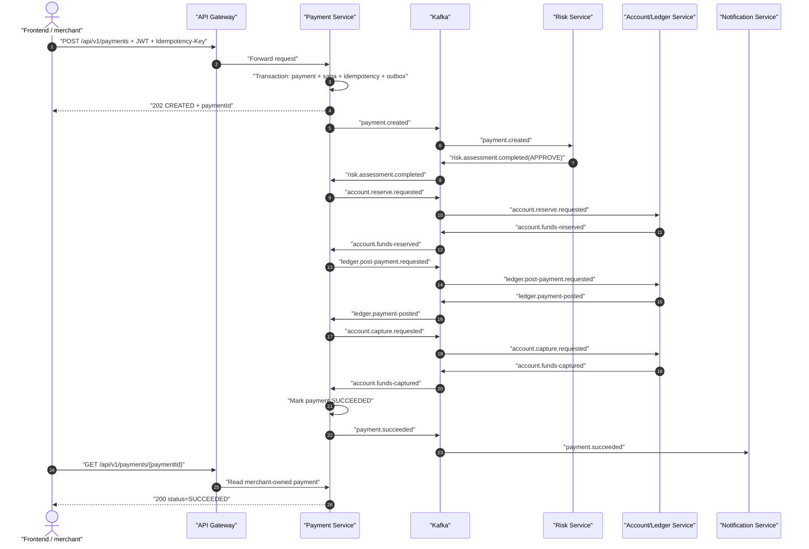

# PayFlow: REST và Kafka chạy cùng nhau như thế nào?

Tài liệu này là điểm bắt đầu ngắn nhất cho người đã quen dự án CRUD REST nhưng chưa quen hệ thống
thanh toán hướng sự kiện. Nếu cần lần source đến từng transaction và adapter, đọc tiếp
[`code-flow-guide.md`](code-flow-guide.md).

Nếu bạn chưa biết Kafka, hoặc cần hiểu sâu riêng phần Kafka — partition/offset/consumer group,
envelope, outbox publisher, inbox chống trùng, retry và dead-letter — đọc
[`kafka-concepts-and-flow-guide.md`](kafka-concepts-and-flow-guide.md).

## 1. Ý chính cần nhớ

PayFlow không thay REST bằng Kafka. Hai cơ chế làm hai việc khác nhau:

| Cơ chế | Ai gọi | Dùng khi nào | Kết quả |
| --- | --- | --- | --- |
| REST | Frontend/merchant → API Gateway → Payment Service | Bắt đầu payment/refund hoặc đọc trạng thái | Phản hồi ngay bằng HTTP |
| Kafka | Các microservice nội bộ | Chuyển từng bước dài của workflow sang service sở hữu nghiệp vụ đó | Kết quả đến sau bằng event |

Vì vậy API `POST` trả `202 Accepted`, không trả `200 Payment succeeded`. `202` chỉ có nghĩa Payment
Service đã xác thực, lưu payment/refund và lưu outbox event thành công. Client lấy `paymentId` rồi gọi
`GET` để xem workflow đã đến trạng thái cuối chưa.

## 2. Vì sao Swagger chỉ có ba API?

Hiện tại chỉ `payment-service` sở hữu public REST API. Các service Risk, Account/Ledger và
Notification là worker nội bộ: chúng nhận event Kafka, cập nhật database riêng và phát event kết quả.
Thêm controller REST giả cho các worker sẽ tạo ra hai đường chạy cho cùng nghiệp vụ và làm Saga khó
kiểm soát.

| API | Scope JWT | API làm gì | Kafka có chạy không? |
| --- | --- | --- | --- |
| `POST /api/v1/payments` | `payment:write` | Nhận payment, chống gửi trùng và tạo Saga | Có, bắt đầu từ `payment.created` |
| `GET /api/v1/payments?status=&from=&to=&page=&size=` | `payment:read` | Tìm payment theo merchant trong JWT, có filter và phân trang giới hạn | Không, đây là truy vấn đồng bộ |
| `GET /api/v1/payments/{paymentId}` | `payment:read` | Đọc trạng thái payment thuộc merchant trong JWT | Không, đây là truy vấn đồng bộ |
| `POST /api/v1/payments/{paymentId}/refunds` | `payment:write` | Giữ hạn mức có thể hoàn và nhận refund | Có, bắt đầu từ `refund.requested` |
| `GET /api/v1/payments/{paymentId}/refunds/{refundId}` | `payment:read` | Đọc refund khi payment, refund và merchant trong JWT cùng khớp | Không, đây là truy vấn đồng bộ |

Hai API `POST` bắt buộc header `Idempotency-Key`. Cùng key + cùng request sẽ replay response cũ;
cùng key + request khác trả `409`. Đây là lớp bảo vệ khi browser, gateway hoặc client retry.

## 3. Luồng payment thành công



Thứ tự `reserve → ledger → capture` là chủ ý: giữ tiền trước, ghi sổ kế toán, rồi mới chuyển tiền đã
giữ thành đã chi. Payment chỉ `SUCCEEDED` sau khi cả ledger và capture đã xác nhận.

Các nhánh không thành công:

- Risk `REJECT` → `payment.failed`; risk `REVIEW` → `MANUAL_REVIEW_REQUIRED`.
- Reserve thiếu tiền → `account.funds-reservation-failed` → `payment.failed`.
- Ledger lỗi sau khi đã reserve → Payment yêu cầu `account.release.requested`; khi đã release mới
  kết thúc `payment.failed`. Nếu không thể xác định kết quả an toàn thì dừng ở manual review.
- Scheduler `RecoverOverdueSagasHandler` phát lại command bị timeout với số lần hữu hạn; không tự suy
  đoán rằng một bước tài chính chưa phản hồi là đã thất bại.

## 4. Luồng refund

```mermaid
sequenceDiagram
    autonumber
    actor FE as "Frontend / merchant"
    participant PAY as "Payment Service"
    participant K as "Kafka"
    participant AL as "Account/Ledger Service"
    participant NOTI as "Notification Service"

    FE->>PAY: "POST /payments/{id}/refunds"
    PAY->>PAY: "Lock payment + reserve refundable capacity + outbox"
    PAY-->>FE: "202 refund CREATED"
    PAY->>K: "refund.requested"
    K->>AL: "refund.requested"
    AL->>K: "ledger.refund-posted"
    K->>PAY: "ledger.refund-posted"
    PAY->>K: "account.refund-credit.requested"
    K->>AL: "account.refund-credit.requested"
    AL->>K: "account.refund-credited"
    K->>PAY: "account.refund-credited"
    PAY->>PAY: "Refund SUCCEEDED; Payment PARTIALLY_REFUNDED/REFUNDED"
    PAY->>K: "refund.succeeded"
    K->>NOTI: "refund.succeeded"
```

Khóa payment khi nhận refund giúp hai request đồng thời không cùng tiêu hết một phần hạn mức hoàn.
Nếu ghi journal refund thất bại thì phát `refund.failed`; không cộng số dư khi chưa có journal.

## 5. Outbox, Inbox và Saga là gì?

- **Transactional Outbox:** service ghi thay đổi nghiệp vụ và một hàng `outbox_events` trong cùng
  transaction. Publisher gửi hàng này lên Kafka sau đó. Nhờ vậy không có trạng thái “đã lưu payment
  nhưng mất event”.
- **Inbox / `processed_events`:** Kafka có thể giao lại cùng message. Consumer ghi `eventId` đã xử lý
  trong cùng transaction với thay đổi nghiệp vụ. Message lặp không trừ/cộng tiền lần hai.
- **Saga:** `payment-service` là orchestrator, lưu bước hiện tại và quyết định command kế tiếp. Không
  có một transaction ACID bao trùm nhiều database; khi bước sau lỗi, Saga phát command bù như release
  số tiền đã reserve.

Do đó delivery là **at-least-once + idempotent**, không tuyên bố exactly-once toàn hệ thống.

## 6. Topic nào xử lý việc gì và source nằm ở đâu?

| Topic | Event/command chính | Producer → consumer | Điểm vào source |
| --- | --- | --- | --- |
| `payflow.payment.events.v1` | `payment.created`, reserve/capture/release và ledger command, payment outcome | Payment → Risk, Account/Ledger, Notification | `CreatePaymentHandler`, `RiskPaymentKafkaListener`, `AccountLedgerWorkflowKafkaListener` |
| `payflow.risk.events.v1` | `risk.assessment.completed` | Risk → Payment | `RiskAssessmentEventFactory`, `PaymentWorkflowKafkaListener` |
| `payflow.account.events.v1` | reserve/capture/release outcome | Account/Ledger → Payment | account handlers, `PaymentWorkflowEventRouter` |
| `payflow.ledger.events.v1` | payment/refund journal outcome | Account/Ledger → Payment | ledger handlers, `PaymentWorkflowEventRouter` |
| `payflow.refund.events.v1` | `refund.requested/succeeded/failed` | Payment → Account/Ledger, Notification | `CreateRefundHandler`, `AccountLedgerWorkflowEventRouter` |
| `payflow.dead-letter.v1` | message consumer không xử lý được sau retry | Consumer lỗi → vận hành | các `KafkaConsumerConfig`, runbook DLT |

Tên topic/event được khóa tại `libs/event-contracts/.../PayFlowTopics.java` và các lớp `*Events.java`.
Schema payload nằm cùng module này để consumer không phụ thuộc code nội bộ của producer.

## 7. Test bằng Swagger UI

1. Chạy Docker MVP với profile `local` như runbook.
2. Mở `http://localhost:8081/swagger-ui.html`. Swagger chạy trực tiếp tại Payment Service để debug;
   ứng dụng thật vẫn nên gọi qua API Gateway ở `http://localhost:8084`.
3. Lấy JWT từ Keycloak rồi bấm **Authorize**, dán token (không cần tự thêm chữ `Bearer`). Token cần
   claim `merchant_id`; POST cần scope `payment:write`, GET cần `payment:read`.

   Có thể lấy service token và chép thẳng vào clipboard bằng PowerShell (command không in secret hay
   token ra màn hình):

   ```powershell
   $secretLine = Select-String -LiteralPath .env -Pattern '^PAYFLOW_SERVICE_CLIENT_SECRET='
   $clientSecret = $secretLine.Line.Split('=', 2)[1]
   $tokenResponse = Invoke-RestMethod -Method Post `
     -Uri 'http://localhost:8180/realms/payflow/protocol/openid-connect/token' `
     -ContentType 'application/x-www-form-urlencoded' `
     -Body @{ grant_type = 'client_credentials'; client_id = 'payflow-service'; client_secret = $clientSecret }
   $tokenResponse.access_token | Set-Clipboard
   ```

4. Gọi `POST /api/v1/payments`, điền một `Idempotency-Key` mới và lưu `data.paymentId`.
5. Gọi `GET /api/v1/payments/{paymentId}` nhiều lần cho đến trạng thái cuối.
6. Gọi lại POST với cùng key và cùng body để thấy cùng `paymentId`; đổi body nhưng giữ key để kiểm tra
   lỗi `409`.

File hợp đồng tĩnh để review/diff là [`docs/api/payment-service-v1.yaml`](../api/payment-service-v1.yaml).
Runtime JSON là `http://localhost:8081/v3/api-docs`. Swagger chỉ bật ở profile `local` (và `test`);
mặc định production tắt cả UI lẫn endpoint JSON.

Swagger UI cố ý dùng server `/` (cùng origin cổng 8081) để nút **Execute** không vướng CORS. Frontend
và external client vẫn đi qua API Gateway cổng 8084 như kiến trúc chuẩn.

## 8. Cách debug mà không bị lạc

Luôn bắt đầu bằng `paymentId`, sau đó đi theo ba lớp:

1. `GET payment` cho biết trạng thái business hiện tại.
2. Log có `paymentId`/`correlationId` cho biết service nào vừa xử lý.
3. Database của từng service: `payment_sagas`, `outbox_events`, `processed_events`; nếu consumer hết
   retry thì xem DLT.

Đừng chỉ nhìn HTTP `202` để kết luận dòng tiền đã hoàn tất, và đừng chỉ nhìn Kafka offset để kết luận
business đã commit. Trạng thái payment cùng các fact Account/Ledger mới là bằng chứng nghiệp vụ.
